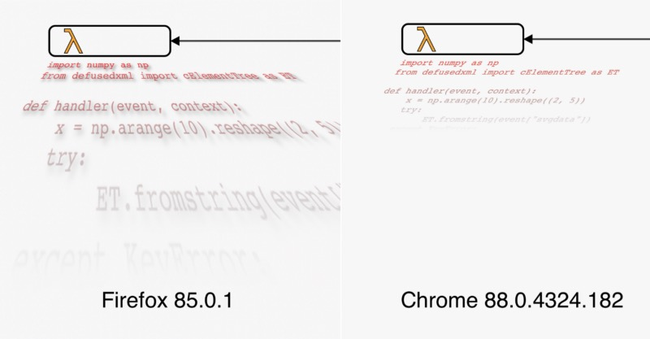
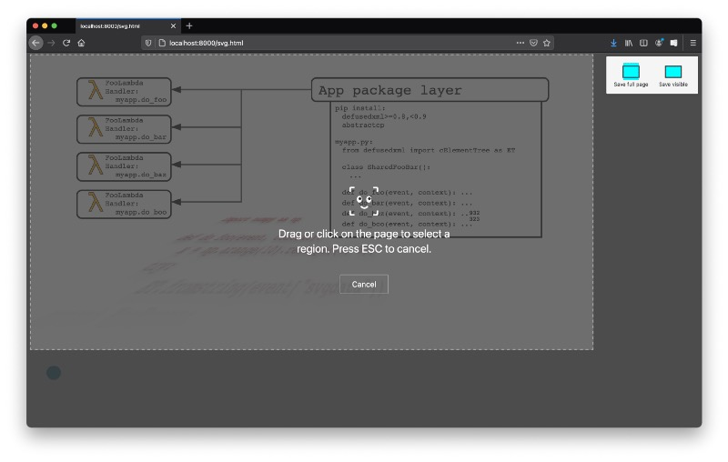
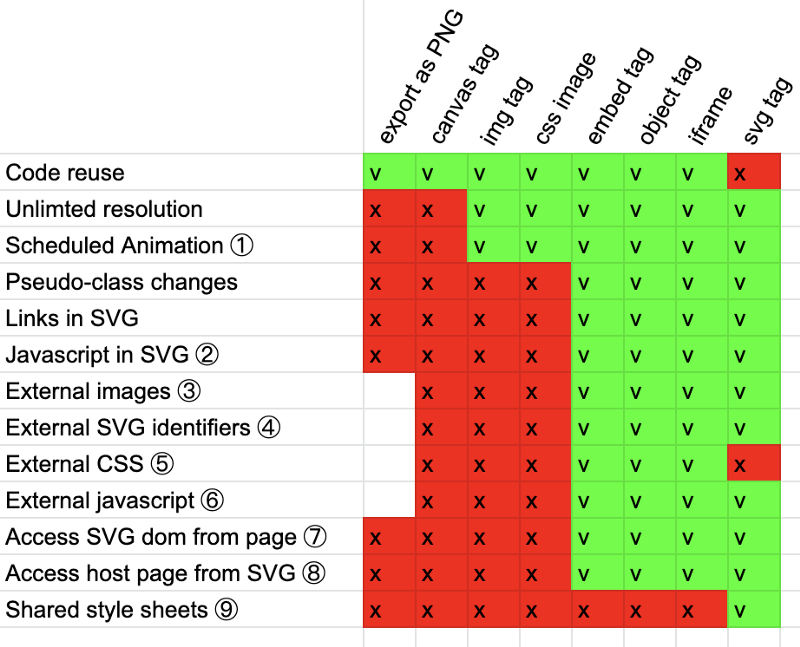
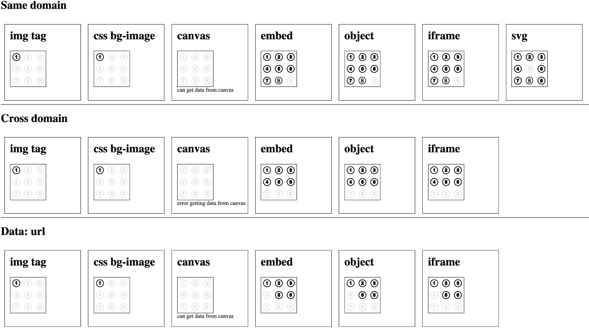

Lately I’ve rekindled my interest in SVG. Using SVG I can declaratively create icons / diagrams / etc, in such a way that both I and the computer can read the sourcecode, and that version control systems, such as github, can easily show me the differences between files. The coverimage for this post was created as a 20 line SVG image (and then converted to PNG since Medium doesn’t support SVG images) — _it also shows you that great technology such as SVG is no match for poor design skills._ If you have never played with SVG, I can definitely advise you to start!

In this blog post, I like to explain the different ways to embed an SVG image into an HTML page. There are different ways to do this, and it seems that different methods allow for different features to be active within the SVGs.

The original post was written on Medium, and therefore refers to some Medium specific features.
Since the blog moved since then, not all sidenotes below apply or make sense (note: in Github Pages you can just use svg as you would in HTML... Jeh!
{: .notice--info}

#### Side note: embedding SVGs in Medium (update: possible since 2021–03–31)

> if you’re looking to embed your SVG in a Medium blog post, there is right now (as far as I know) no good way to do so. When you upload an SVG as an image, you will quickly see it flicker in place and then be replaced by a message that you can only upload PNG/JPEG/GIF. You can put the svg as gist on github and then embed it; it will render it within a large grey frame; it will NOT look just like an image….  
> UPDATE: 2021–03–31: Since my embed is live, you can. See [my medium post about this](https://claude-e-e.medium.com/how-to-embed-svg-images-on-medium-eb2aaaca69ad)!

> Medium uses embed.ly for its embeds. I did make a small embedly capable site that should be able to embed SVGs in a much nicer way on Medium. This is under review by embedly; I will post when there is more info on this. The rest of this blog post is about how to embed SVGs into normal HTML files.

#### Side note 2: debunked — all modern browsers render SVG the same way

> Before going any further, I should also note that SVG support among browsers certainly still contains differences. Especially if you’re using more advanced SVG features, not all browsers may support them, or react the same. If you’re using advanced SVG features, and you want to make sure that your audience experiences it the way you intended, just export to PNG and include that, unfortunately…


  


#### Side note 3: Converting SVGs to PNGs — free and _with all bells and whistles that a browser supports_

> I’ve been looking for a good way to export SVGs into PNGs, for those cases that SVGs just don’t cut it (i.e. complex non-cross-browser compatible SVGs, Medium posts, etc). It turns out that pretty much anyone who says they can do this (websites, commandline tools, etc), cannot actually deal with slightly more complex SVGs. After many a complex tool (of which [svgexport](https://www.npmjs.com/package/svgexport) is possibly the best, however it is based on Chromium and therefore was unable to properly render the image above), and building some myself (especially: having an HTML page that loads an SVG file, then renders it into a canvas objects, and then use `canvas.toDataURL()` to convert it to PNG), as well as simple ones (just take a screenshot on your mac, and manually trim it to the dimensions you want), the solution as as simple as can be: FireFox has a [built in screenshot](https://support.mozilla.org/en-US/kb/firefox-screenshots) tool. This tool actually allows you to select the region you want to screenshot _based on DOM elements_, so you can easily select just the SVG — presto! Note that you should (obviously) make sure your SVGs are displayed on 100%, and on 2&times; retina screens, your PNG will have 4 pixels for each SVG "pixel".

> **UPDATE:** I‘m back to searching for a good tool for this; it seem that with more complex SVGs, the screenshot tool does not match the screen 1-to-1 :(.


  


### Main story: Embedding SVGs into HTML, the basics

#### Different ways to embed an SVG

SVGs can be embedded into an HTML page in different ways (**TL;DR** don’t just pick the top one (or a random one), for features and security it really matters what you choose!):

*   Export the SVG to PNG and just do an ``. This always works, in all browsers, without any surprises (and is secure :)). See the section above on how to do this export. Obviously this will loose any of the advantages of SVG, such as file size, and scalability.
*   [`img` tag](https://developer.mozilla.org/en-US/docs/Web/HTML/Element/img): ``. This will convert the image for all means and purposes into static image (or an image with static animation).
*   Through the CSS property`background-image`: `#element {background-image: url(image.svg);}`.
*   [`embed` tag](https://developer.mozilla.org/en-US/docs/Web/HTML/Element/embed): `<embed src="image.svg" ...>`. The embed tag is used to point to external content.
*   [`object` tag](https://developer.mozilla.org/en-US/docs/Web/HTML/Element/object): `<object type="image/svg+xml" data="image.svg ...>`. The object tag represents an external resource.
*   [`iframe` tag](https://developer.mozilla.org/en-US/docs/Web/HTML/Element/iframe): `<iframe src="image.svg" ...>`. An iframe represents a nested browsing context; since a browser can show an (svg) by itself, it can also show an svg document/image in an iframe (or a regular frame for that matter).
*   [`svg` tag](https://developer.mozilla.org/en-US/docs/Web/SVG/Element/svg): `<svg xmlns="http://www.w3.org/2000/svg"><circle cx="50" cy="50" r="40" /></svg>`. Using the svg tag, SVG can be put directly into the HTML file. The `svg` tag cannot be used directly to load an external SVG file.
*   [`canvas` tag](https://developer.mozilla.org/en-US/docs/Web/HTML/Element/canvas): For completeness sake, it is possible (with javascript) to draw an svg into a canvas — it’s just using the browser to convert the SVG into a PNG. I include it here as reference, but it’s not an entirely fair comparison; since we use javascript,

The reason that we _need_ to talk about how these embed options differ, is that SVGs can actually do a lot. Whether this "lot" is what you actually want and expect, depends on what you intend for your SVG to be.

### An SVG is an image — but awesomer

It its simplest form, an SVG is an image (as the name Scalable Vector Graphics suggests). However, an SVG can be so much more. It should be noted that the list below describes properties that are not always desirable; whether a property is available depends on how you include your SVG into your document. Some of the properties below have numbers behind them; these numbers correspond to the numbers in the test images for each behaviour — the properties without number are harder to show in test images, however were tested in other ways.

*   Code reuse: as with an image, you can define an SVG file once and then load into your site in many places.
*   Unlimited resolution: Since an SVG is vector based, it has no "pixels". This means you can zoom in on an SVG circle indefinitely (or: as far as the browser allows), and you will never see it become pixelated.
*   Scheduled Animation: An SVG can contain different kinds of animation. In this point I would like to talk about scheduled animation, or non-interactive animation. This can be compared to animation in an animated gif, as in that it starts and animates regardless of what a user does. Unlike an animated gif however, it can easily contain millions of different "frames" without becoming a large file. An example of a scheduled animation is `<circle cx="35" cy="45" r="4"><animate attributeName="r" values="1;10;1" dur="5s" repeatCount="indefinite" /></circle>`. ①
*   Pseudo-class based interactive changes: An SVG can use CSS to style itself, and, as such, can use css pseudo-classes. Using for instance the `:hover` pseudo-class, an element can be made that animates (changes color, size, etc) when one hovers the mouse over it: `.button {fill: black;} .button:hover {fill: red;}`. Note that scheduled animation can also be made in CSS, and pseudo class based changes can also contain animations; the important distinction between these two features however is whether the changes are triggered anyways, or triggered by some user action.
*   Links: SVG files can contain `<a href="https://www.google.com/" ...>` tags to make certain elements link to another page.
*   Javascript: SVG files can contain ``. ⑥
*   Access to the SVG dom from within the hosting HTML page. You can use javascript on the page to access and edit data within the SVG. ⑦
*   Access to the hosting HTML page from the javascript running inside the SVG ⑧
*   The styles inside the SVG interact with the styles in the HTML document (meaning that you can use style sheets within HTML to style the SVG, however also that any styles within the SVG can be used to style the HTML — moreover, if you have 2 SVGs in a page, the style sheets defined in one will interact with the style sheets in the other. ⑨

We want to describe for each of the properties in the previous list whether they are possible, depending on how you embed your SVG. The intention is to describe how modern browsers act, and what the documentation about this is. I will test all behaviour in the current versions of Safari, Chrome and Firefox I have installed. The goal is explicitly _not_ to find exactly which browsers and versions act how — use [caniuse.com](https://caniuse.com) or [MDN](https://developer.mozilla.org/en-US/) for that.

Another difference that peeps up between embedding methods, is how SVGs scale in their containers. This subject is so complex that it warrants a whole blog by itself, and [luckily someone already did that](https://css-tricks.com/scale-svg/)! The bottomline is: there are differences, and I’m not going to talk about them.

### Results (simple)

In the table below I try to make make clear what embedding methods support what properties. It should be noted that this is a table with lots of (foot)notes, which I describe below.


  


I made a test page, testing all the numbered properties — each number is only shown through the property that it describes; e.g., the ① is being shown by a scheduled animation changing the opacity. Every embed method I tried three times, in one the SVG is hosted on the same domain; in the second batch the svg is hosted on a different domain from the hosting page (note that in this case any external resources loaded _within_ the svg are from the same domain as the svg). In the final run the SVG is expressed as a data url: `data:image/svg+xml;charset=utf-8;base64,PD94bW...`. The code used for these tests can be [found on github](https://github.com/reinhrst/svgtest).


  


### The results (all the small details)

There are lots of small details, conclusions, extra documentation, which I like to share here.

In general, we can distinguish 4 ways of hosting an SVG:

*   Transform into a bitmap (either by saving it as a PNG, or by drawing it on a canvas). In both ways you loose the vector-ness of the image (also meaning that if you want your image to look good on a retina screen, make sure you double the resolution of your canvas/PNG file). You get the features that were showing when exporting the image (export), or none at all when using a canvas. You loose all other fancy svg things (I guess you could try to export an SVG to an animated gif, that way keeping some animation).  
    An svg loaded from another domain can be drawn into a canvas, however it’s impossible then to get any data out of the canvas through javascript — this is the same behaviour as you would get when loading a PNG from another domain.
*   Hosting it as an image, either through the `` tag or as a css `background-image:` command. Note that this mode is also used if hosting an external svg image inside an svg through the `<image href="..." />` tag. W3C [describes what we can expect an image to be](https://www.w3.org/TR/html52/semantics-embedded-content.html#the-img-element) (see screenhot below), and this is exactly what we find an image to be: static image, animation allowed however no interactive stuff or anything else fancy.

*   Embedding through `<embed>`, `<object>` or `<iframe>`. All three allow exactly the same access from outside into the SVG as well as from the SVG to outside, while at the same time having separation (no interference of style sheets), and allowing using an external SVG file as source.  
    As expected, when the svg is served from a domain that is different from the HTML file, any calls from HTML to SVG and reverse fail (i.e. ⑦, ⑧), due to cross domain protection. Note that a data URI is also treated as another domain.  
    In case of a `data:` url, the external SVG file that we’re trying to include a segment from is on another domain, that is why test ④ fails on these urls.  
    Obviously some of these cross domain problems could be resolved with the appropriate [CORS headers](https://developer.mozilla.org/en-US/docs/Web/HTTP/CORS).
*   Putting the svg code inline in the HTML file, using the html `<svg>` tag. In this case the SVG is part of the HTML DOM; this means full immersion, you can use the CSS of your HTML page to style your SVG. You can create SVG selectors that combine an HTML and SVG path (e.g. `div.contentblock path.wing {fill: green;}`), something that is not possible in any other embedding method. The downside of this is that you loose any separation, and if you have more than 1 `svg` tag, you might start getting collisions in the styles.  
    Embedding an external style-sheet within this tag fails; this makes sense however, since the way to embed an external stylesheet in an `svg` file is by adding a tag `<?xml-stylesheet type="text/css" href="style.css" ?>` _outside_ the `<svg>...</svg>` tags. This means that trying to do this in the `<svg>` embed method leads to an `<?xml-stylesheet type="text/css" href="style.css" ?>` tag inside the _html_ of the page, and this gets ignored. Obviously it is possible to use a `<link rel="stylesheet" href="styles.css">` in your HTML and embed an extrenal style sheet this way.
