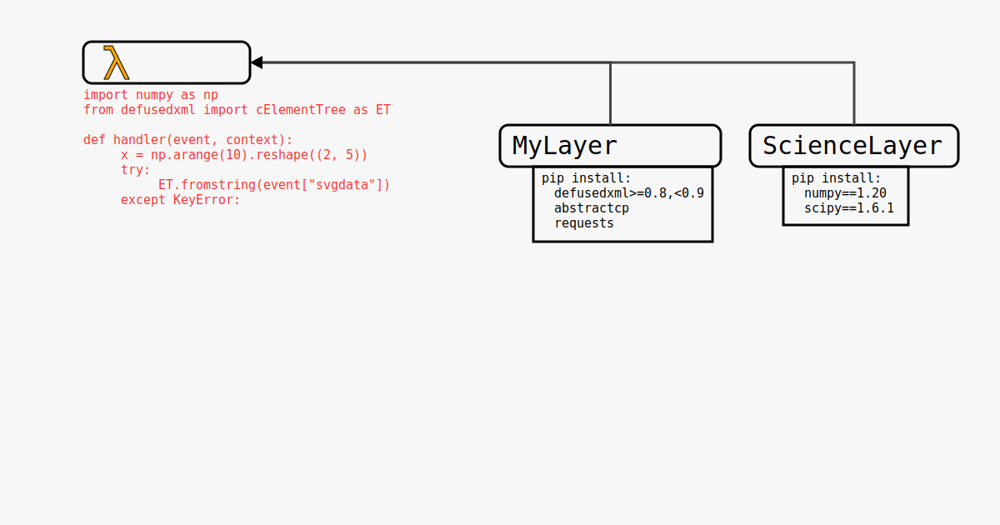
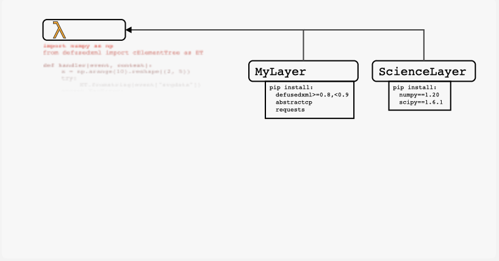

In one of my previous posts I mentioned that I was still looking for the best way to convert SVG into PNG.
If you just Google "Convert SVG to PNG" you will get hundreds of hits, from Inkscape, to online tools, to photo editors that can import SVGs (I know Pixelmator Pro claims to support SVG imports).
For simple SVGs these options may work, but I'm tend to explore the boundaries of what is possible in SVGs.
Also, if you offer to convert an SVG to an PNG, you better (at least) offer me a way to specify the resolution that I want my PNG to be; you cannot just assume that the `viewBox` of the SVG says anything about the resolution it's meant to be shown at.

Today I'm happy to announce that I found my way to do this: script Firefox to screenshot an SVG, with the exact boundaries I want, at the exact resolution I want.


SVG2PNG on  GitHub


The tool is also available as docker container, just build it from the GitHub repository.


Update: after using this method for a while, I found one drawback: it does not export transparency properly; it just gives your SVG a white background.
This is a shame; Safari does export the background transparency (but then has problems rendering the SVGs....).
To be continued!


## What is it
A command line script that one can run, give some parameters like width and height, or even custom JavaScript that needs to be run before the conversion, and that outputs a PNG file.

The main reason that I need this, is that I like using SVGs in these blog posts, however many websites (like Facebook and LinkedIn, consumers of the Open Graph image I serve with each blog post) don't support SVG.
So I need a tool to convert it to PNG, preferably automatically.

## Why Firefox
Over all my time with SVGs, Firefox has consistently been the best renderer.
As a small example, the following SVG:


      
      
      
      



This is not a full comparison of all converters and which support which features; rather my point is: Firefox is in my experience the best.

## Scripting Firefox

There are multiple ways to script Firefox.
A common one is to use the WebDriver protocol, through a [small program called geckodriver](https://github.com/mozilla/geckodriver/releases).
The simplest way to use WebDriver is through Selenium, a tool that is primarily *for automating web applications for testing purposes, but is certainly not limited to just that* (from the [Selenium website](https://www.selenium.dev).
Using the [Selenium WebDriver bindings for Python](https://pypi.org/project/selenium/) I built a first version, that did exactly what was needed.
The problem: too many moving parts -- you need `geckodriver` and a `pip install selenium`.

As a second version, I experimented with directly making "WebDriver" calls to `geckodriver` using `curl`:
```bash
curl -X POST "localhost:4444/session" --data '{"capabilities": {"alwaysMatch": {}}}' -H "Content-Type: application/json; charset=utf-8"
curl -X POST "localhost:4444/session/d6b5812e-962d-9f46-8d70-cf4ec999293a/url" --data '{"url": "file:///Volumes/Work/reinhrst.github.io/assets/images/2021/08/10/results-js-and-go-speedup.svg"}' -H "Content-Type: application/json; charset=utf-8"
```

It works, but takes quite some overhead, and still requires `geckodriver`.

It turns out that `geckodriver` is not much more than a translation between `WebDriver` on the one end, and the Firefox `Marionette` protocol on the other end; so if we learn to speak "Marionette", we should be able to get rid of `geckodriver`.

### Marionette
The Marionette protocol is not well documented, however since all of Firefox is open source, if you know where to look, you can find it. I documented my findings [in this StackOverflow answer](https://stackoverflow.com/a/68747295/1207489):

- each message is a length-prefixed json message without newline (so for instance, when you connect `telnet localhost 2828`, you're greeted by `50:{"applicationType":"gecko","marionetteProtocol":3}`, the `50` meaning the json is 50 bytes long.
- each message (except for the first one) are a json array of 4 items:
    - `[0, messageId, command, body]` for a request, where `messageId` is an int, `command` a string and `body` an object. Example (with length prefix) `31:[0,1,"WebDriver:NewSession",{}]`
    - `[1, messageId, error, reply]` for a reply. Here `messageId` is the id the reply was to, and either `error` or `result` is null (depending on whether there is an error). E.g. `697:[1,1,null,{"sessionId":"d9dbe...", ..., "proxy":{}}}]`
- A full list of all commands can be found in the [Marionette source code](https://searchfox.org/mozilla-central/source/remote/marionette/driver.js), and it seems to me that all functions there are pretty well documented. For one thing, it seems that they expose all WebDriver functions under `WebDriver:*`.

In the linked [Marionette source code](https://searchfox.org/mozilla-central/source/remote/marionette/driver.js), there is a list of all commands, and to which JavaScript function they map.
The arguments that are valid for that function (which are well documented) are exactly what you can give as arguments in the Marionette call.

The last part of the puzzle is how to start a (hidden) Firefox session to connect to (by default Marionette uses port `2828`, which obviously leads to problems if you try to start more than one in parallel.
The solution is to start FireFox with a profile that has a user preference for `marionette.port` set to `0`. 
Then when it starts Firefox will choose a random free port, and write this to the user preferences file.
A proof of concept in bash:
```bash
TEMPD="$(mktemp -d)"
echo 'user_pref("marionette.port", 0);' >  "${TEMPD}"/prefs.js
/Applications/Firefox.app/Contents/MacOS/firefox-bin --marionette --headless --no-remote --profile "${TEMPD}" &
MARIONETTE_PORT=""
while [ -z "$MARIONETTE_PORT" ]; do
  sleep 1
  MARIONETTE_PORT=$(cat "${TEMPD}"/prefs.js | grep 'user_pref("marionette.port"' | grep -oE '[1-9][0-9]*')
done
echo "Marionette started on port $MARIONETTE_PORT"
fg
```

## Putting it all together
I wrote it all up in a [less-than-200-line python file](https://github.com/reinhrst/svg2png/blob/main/main.py).
It starts Firefox, opens a url (this can be a `file:///` url; but actually also works fine with a remote SVG file, or even a whole webpage), runs some custom JavaScript to set the width and height, or other properties if you want to.
And finally asks Firefox to save a screenshot of the `:root` element to a PNG file.
And, because it's all in python, it should be easy to add custom things, delays, waiting for a specific event, etc.

It turns out that headless Firefox is also very happy to run in a Docker container, so a `Dockerfile` is provided as well.

For more info, see the [README.md file](https://github.com/reinhrst/svg2png).

## Bonus: saving a page as PDF
I remember a couple of years ago struggling a lot to get an HTML page to convert to PDF (this was for a website I was working on, where someone could click a report together, and then download it as a PDF).
With my new-found powers I wanted to see if this could be done through the same method.
The [result](https://github.com/reinhrst/svg2png/tree/printpdf) is almost the same as the SVG2PNG exporter:


PrintPDF on  Github

