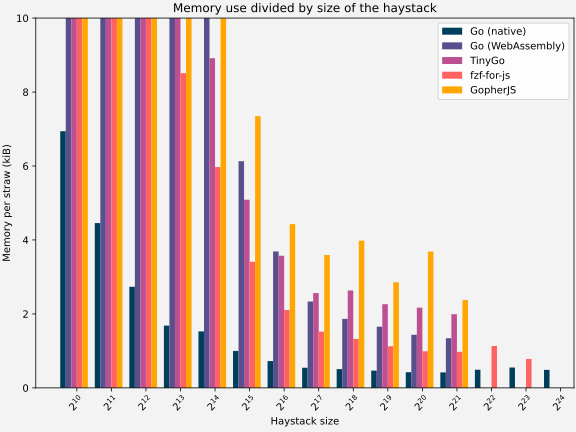
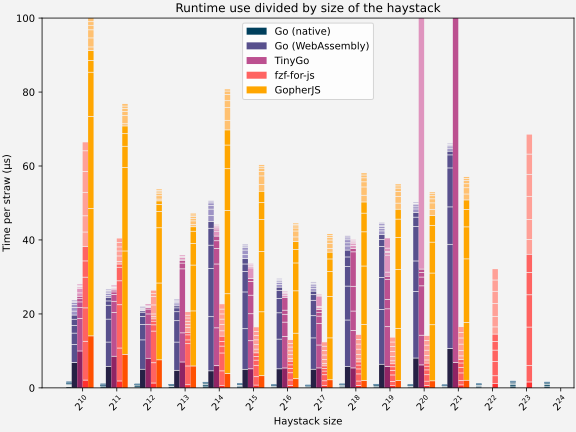
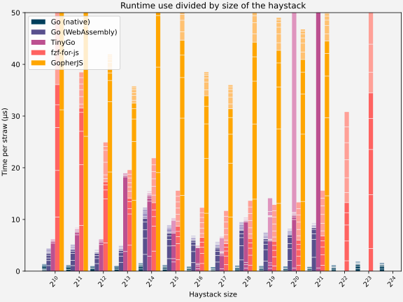
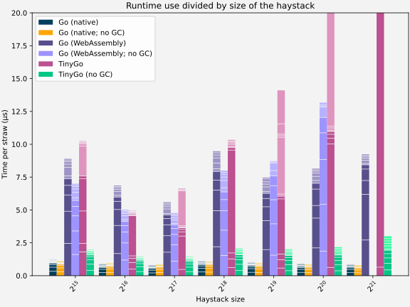
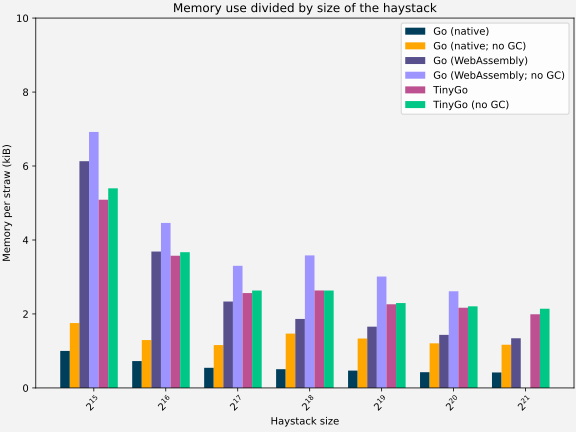
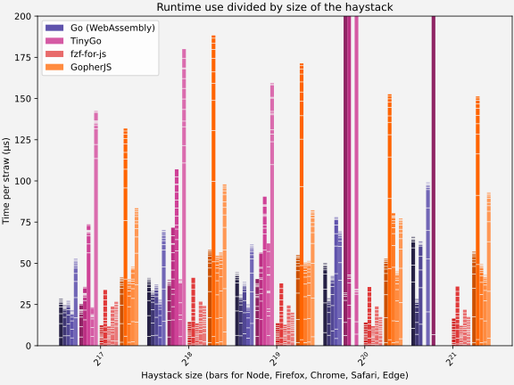

In past posts in this series, I looked at how to convert a Go library in order for it to work in the browser.
We used both the standard go compiler and TinyGo to compile Go code to WebAssembly, and we used GopherJS to compile Go code to JavaScript.
If you did not read that post, I [very much advice you to do so now](./2021-08-10-using-a-go-library-fzf-lib-in-the-browser.md); this post builds on that one, and readers are assumed to know the information in that post 

In this post we'll dive deeper into performance:
- We admit a new contender: [`fzf-for-js`](https://github.com/ajitid/fzf-for-js), a (manual) JavaScript port of `fzf`.
- In the last test we did one simple performance test; this time we'll test with different amounts of data to search in, and different access patterns.
- Some compilers allow different compile flags that influence performance, we'll play with those a bit.
- Before we simply tested in node; this time we'll extend the test to different platforms (i.e. browsers).

# `fzf-for-js`, a JavaScript port of `fzf`
As I mentioned in the [previous post](./2021-08-10-using-a-go-library-fzf-lib-in-the-browser.md), there are generally 4 ways to get some Go code to run in the browser: compile it to WebAssembly, compile it to JavaScript, manually write it in WebAssembly (or possibly in C and compile that) and manually write it in JavaScript.
In the [last post](./2021-08-10-using-a-go-library-fzf-lib-in-the-browser.md) I showed 2 solutions based on a Go → WebAssembly compiler (Go & TinyGo), and a single solution based on a Go → JavaScript compiler (GopherJS).
When I first started looking at compiling the Go code a couple of months ago, I did have in the back of my mind that I wanted to manually port it to JavaScript as well, if only to see how much better (or worse) I would be compared to the automatic tools.

Back then I had obviously checked if someone had already done this, and nobody had. So I was very surprised when a couple of weeks ago I ran into [`fzf-for-js`](https://github.com/ajitid/fzf-for-js).
This project aims to port the `fzf` code (or at least the same part that I called the core, when deciding what to include in `fzf-lib`) to TypeScript -- so unlike some of the other efforts out there (including my own ill-conceived-now-discontinued one), he didn't try to reverse engineer the `fzf` code from example inputs and outputs, and then rebuild it in JavaScript (trust me, getting 95% to work, is no problem. The last 5% is hell!), but rather tries to port the Go code file by file.


In order to be accurate, I have to clarify something.
`fzf-for-js` is, like many large JavaScript projects, not actually written in JavaScript, but in TypeScript.
So technically it could look as if we're comparing a Go → JavaScript compiler with a TypeScript to JavaScript compiler.
This is not the right way to look at it though; Go and JavaScript are hugely different languages and compiling from one to the other is far from trivial.
TypeScript on the other hand is just a wrapper around JavaScript; one writes JavaScript, with JavaScript standard libraries, just with types and some additional syntax to make the programmer's life easier.
So, from performance point of view it makes no difference if something is written in JavaScript or TypeScript, and I will treat them as similar in this post.


The project is very new, and being actively developed (there were a dozen commits in just the last week).
Not everything is possible yet (for instance, at the time of writing caching is not yet included; I wouldn't be surprised if it is by the time you read this), however the hard part, getting the exact same behaviour as Fzf algorithm v2, is working.
I am running the tests here with [revision `e8a150d`](https://github.com/ajitid/fzf-for-js/tree/e8a150db6d2e452a93799f79b627eddf78897809), which is [version `v0.4.1`](https://github.com/ajitid/fzf-for-js/releases/tag/v0.4.1) with a small bug fix.


The author of this project asked me not to include this port yet in any performance-metric, since most of the work in the past couple of months has gone into getting the features to work, and no focus has been put yet on performance improvements 
I do think it's fair though to include it, with this disclaimer that no special focus has been put on performance yet.
I think that for others who contemplate different ways to get their Go code to run in the browser, it is extremely valuable to see as many options as possible, even if they are not yet fully developed, luckily the author agreed, and so I can include this now.


As we saw in the [last post](./2021-08-10-using-a-go-library-fzf-lib-in-the-browser.md), one of the potential drawbacks of compiling code from Go to WebAssembly/JavaScript is the size of the output file.
In that post I explained more about how we measure this for the different projects.
It's obvious that `fzf-for-js` takes home the crown for smallest library size (even if we take into account that maybe a small code increase is needed to gain full feature parity).


**UPDATE -- tinygo compilation size**

*2021-09-20* After publication I was in contact with one of the TinyGo authors.
They mentioned that by default TinyGo includes debug symbols in the WebAssembly file, and that these can be removed by compiling with `-no-debug`.
This indeed brings down the size considerably, while keeping similar performance.

There are additional ways to compress the code even further (using `wasm-opt -Oz`) but I couldn't get this to work quickly on my system, so it was not tested.
This would resportedly result in a small additional improvement, which might influence performance as well.

Trying to do the Go --> WebAssembly compilation without debug symbols (using `-ldflags='-s -w'` only resulted in a minimal difference in file size).


The data below has been updated (old numbers stricken through, new numbers inserted) to reflect these nem numbers.

It should be noted that the performance data throughout the rest of the article has been collected using the TinyGo compiled without the `-no-debug` flag; the `-no-debug` flag has also not be added to the code in the repo.


<figure markdown="1">

| |Go | TinyGo | GopherJS | GopherJS (minified) | `fzf-for-js` (es) | `fzf-for-js` (umd)
|-|---|--------|----------|---------------------|-------------------|-------------------
| Uncompressed| 2.5 MB | ~~698 kB~~ 273 kB | 1.7 MB | 1.1 MB | 13.7 kB | 14.7 kB |
| Brotli compression | 535 kB | ~~216 kB~~ 85 kB | 181 kB | 148 kB | 4.9 kB | 5.2 kB |

<figcaption markdown="1">`fzf-for-js` comes in two flavours, as es module, or as umd module. Either of them is in compressed form around 5kB, or about a factor ~~30(!)~~15 smaller than the smallest compiled Go version. (uncompressed the difference is even larger)
</figcaption>
</figure>

# Differences in results between versions
Obviously the expectation was that all four versions would give exactly the same results -- the same hay straws in the same order, with the same scores, and the same positions where the match was made.

During the tests I found that this was not 100% true; the first issue is that `fzf-for-js` sorts matches by length of the hay straw if requested (same as default behaviour for `lib-fzf`), however where `fzf` sorts on the trimmed length, `fzf-for-js` sorts on the non-trimmed length (a [pull request to fix this](https://github.com/ajitid/fzf-for-js/pull/72) was rejected by the author of `fzf-for-js`).
However `fzf-for-js` has an amazing option where one provides their own tiebreaker function; this way `fzf-for-js` can be made to behave the same as `fzf-lib` (which I did for these tests).

Another minute difference occurred in positions reported by the compiled Go library and `fzf-for-js`; both were correct, but different. So for instance (a much simplified example, that doesn't actually result in a difference) if searching for `a` in `baa`, one method reports a match at positions `[1]`, the other at positions `[2]`.

The difference seems to be a bug in the caching code of `lib-fzf`, since it only happens if a search is preceded by another search.
It only happens very rarely and no more time was spent on researching this.

Finally, there is a small issue where there is a difference between the WebAssembly code (both through Go and TinyGo compilers) and the GopherJS code.
It seems to happen when calculating the length of a string with a non-ASCII character in it.
Interesting difference, but not essential (for English speakers/Latin writers at least).

The conclusion needs to be that all 4 version (when using the custom tiebreaker for `fzf-for-js`) have (essentially) the same results for all practical purposes.

# Testing other kinds of data and access
I mentioned in the [last post](./2021-08-10-using-a-go-library-fzf-lib-in-the-browser.md) that the performance test we did then was a bit artificial.
We generated list of random sentences, and then looked for "hello world".
Obviously `fzf` in a browser could be used in any number of situations, however I expect in many case the search to be incremental, a user typing one letter at a time, and the browser showing results from each action.

Each test consists of searching for the fuzzy string "h", then "he" then "hel", until we search for "hello world" (needle) in a number of lines (the haystack).
The haystack will consist of the top `X` lines from the Linux kernel source code (gotten by running `rg --line-number --no-heading . | head -n X` in the Linux `5.14 rc 6` code tree.


```
sound/last.c:22:		}
sound/last.c:23:	}
sound/last.c:24:	if (ok == 0)
sound/last.c:25:		printk(KERN_INFO "  No soundcards found.\n");
sound/last.c:26:	return 0;
sound/last.c:27:}
sound/last.c:29:late_initcall_sync(alsa_sound_last_init);
kernel/configs.c:1:// SPDX-License-Identifier: GPL-2.0-or-later
kernel/configs.c:2:/*
kernel/configs.c:3: * kernel/configs.c
kernel/configs.c:4: * Echo the kernel .config file used to build the kernel
kernel/configs.c:5: *
kernel/configs.c:6: * Copyright (C) 2002 Khalid Aziz <khalid_aziz@hp.com>
kernel/configs.c:7: * Copyright (C) 2002 Randy Dunlap <rdunlap@xenotime.net>
kernel/configs.c:8: * Copyright (C) 2002 Al Stone <ahs3@fc.hp.com>
kernel/configs.c:9: * Copyright (C) 2002 Hewlett-Packard Company
kernel/configs.c:10: */
kernel/configs.c:12:#include <linux/kernel.h>
kernel/configs.c:13:#include <linux/module.h>
kernel/configs.c:14:#include <linux/proc_fs.h>
kernel/configs.c:15:#include <linux/seq_file.h>
kernel/configs.c:16:#include <linux/init.h>
kernel/configs.c:17:#include <linux/uaccess.h>
kernel/configs.c:19:/*
kernel/configs.c:20: * "IKCFG_ST" and "IKCFG_ED" are used to extract the config data from
kernel/configs.c:21: * a binary kernel image or a module. See scripts/extract-ikconfig.
kernel/configs.c:22: */
kernel/configs.c:23:asm (
kernel/configs.c:24:"	.pushsection .rodata, \"a\"		\n"
kernel/configs.c:25:"	.ascii \"IKCFG_ST\"			\n"
kernel/configs.c:26:"	.global kernel_config_data		\n"
kernel/configs.c:27:"kernel_config_data:				\n"
kernel/configs.c:28:"	.incbin \"kernel/config_data.gz\"	\n"
kernel/configs.c:29:"	.global kernel_config_data_end		\n"
kernel/configs.c:30:"kernel_config_data_end:			\n"
kernel/configs.c:31:"	.ascii \"IKCFG_ED\"			\n"
kernel/configs.c:32:"	.popsection				\n"
kernel/configs.c:33:);
kernel/configs.c:35:#ifdef CONFIG_IKCONFIG_PROC
kernel/configs.c:37:extern char kernel_config_data;
kernel/configs.c:38:extern char kernel_config_data_end;
kernel/configs.c:40:static ssize_t
kernel/configs.c:41:ikconfig_read_current(struct file *file, char __user *buf,
kernel/configs.c:42:		      size_t len, loff_t * offset)
kernel/configs.c:43:{
kernel/configs.c:44:	return simple_read_from_buffer(buf, len, offset,
kernel/configs.c:45:				       &kernel_config_data,
kernel/configs.c:46:				       &kernel_config_data_end -
kernel/configs.c:47:				       &kernel_config_data);
kernel/configs.c:48:}
kernel/configs.c:50:static const struct proc_ops config_gz_proc_ops = {
kernel/configs.c:51:	.proc_read	= ikconfig_read_current,
kernel/configs.c:52:	.proc_lseek	= default_llseek,
kernel/configs.c:53:};
kernel/configs.c:55:static int __init ikconfig_init(void)
kernel/configs.c:56:{
kernel/configs.c:57:	struct proc_dir_entry *entry;
kernel/configs.c:59:	/* create the current config file */
kernel/configs.c:60:	entry = proc_create("config.gz", S_IFREG | S_IRUGO, NULL,
kernel/configs.c:61:			    &config_gz_proc_ops);
kernel/configs.c:62:	if (!entry)
kernel/configs.c:63:		return -ENOMEM;
kernel/configs.c:65:	proc_set_size(entry, &kernel_config_data_end - &kernel_config_data);
kernel/configs.c:67:	return 0;
kernel/configs.c:68:}
kernel/configs.c:70:static void __exit ikconfig_cleanup(void)
kernel/configs.c:71:{
kernel/configs.c:72:	remove_proc_entry("config.gz", NULL);
kernel/configs.c:73:}
kernel/configs.c:75:module_init(ikconfig_init);
kernel/configs.c:76:module_exit(ikconfig_cleanup);
kernel/configs.c:78:#endif /* CONFIG_IKCONFIG_PROC */
kernel/configs.c:80:MODULE_LICENSE("GPL");
kernel/configs.c:81:MODULE_AUTHOR("Randy Dunlap");
kernel/configs.c:82:MODULE_DESCRIPTION("Echo the kernel .config file used to build the kernel");
block/blk-core.c:1:// SPDX-License-Identifier: GPL-2.0
block/blk-core.c:2:/*
block/blk-core.c:3: * Copyright (C) 1991, 1992 Linus Torvalds
block/blk-core.c:4: * Copyright (C) 1994,      Karl Keyte: Added support for disk statistics
block/blk-core.c:5: * Elevator latency, (C) 2000  Andrea Arcangeli <andrea@suse.de> SuSE
block/blk-core.c:6: * Queue request tables / lock, selectable elevator, Jens Axboe <axboe@suse.de>
block/blk-core.c:7: * kernel-doc documentation started by NeilBrown <neilb@cse.unsw.edu.au>
block/blk-core.c:8: *	-  July2000
block/blk-core.c:9: * bio rewrite, highmem i/o, etc, Jens Axboe <axboe@suse.de> - may 2001
block/blk-core.c:10: */
block/blk-core.c:12:/*
block/blk-core.c:13: * This handles all read/write requests to block devices
block/blk-core.c:14: */
block/blk-core.c:15:#include <linux/kernel.h>
block/blk-core.c:16:#include <linux/module.h>
block/blk-core.c:17:#include <linux/backing-dev.h>
block/blk-core.c:18:#include <linux/bio.h>
block/blk-core.c:19:#include <linux/blkdev.h>
block/blk-core.c:20:#include <linux/blk-mq.h>
block/blk-core.c:21:#include <linux/blk-pm.h>
block/blk-core.c:22:#include <linux/highmem.h>
block/blk-core.c:23:#include <linux/mm.h>
block/blk-core.c:24:#include <linux/pagemap.h>
block/blk-core.c:25:#include <linux/kernel_stat.h>
block/blk-core.c:26:#include <linux/string.h>
```


All tests are run in node (v16.4.2).
We increase the haystack in steps of factor 2 from 1024 until 16.4M lines.
Between runs with different haystack sizes, node is restarted.
I run the code used in the [last post](./2021-08-10-using-a-go-library-fzf-lib-in-the-browser.md) ([tag `performance-testing` of the `fzf-js` repo](https://github.com/reinhrst/fzf-js/releases/tag/performance-testing)).

The `main.mjs` file is pretty much the same as in the [last post](./2021-08-10-using-a-go-library-fzf-lib-in-the-browser.md), however with some small changes to do multiple searches, and output the output that we need.


```javascript
import {createReadStream} from "fs"
import {Writable} from "stream"


function memoryUsageInMiB() {
  const memUsage = process.memoryUsage()
  let memUsageMiB = {}
  for (let key in memUsage) {
    memUsageMiB[key] = memUsage[key] / 1024 / 1024
  }
  return memUsageMiB
}

function increase(s, start) {
  let items = []
  for (let i=start; i <= s.length; i++) {
    items.push(s.slice(0, i));
  }
  return items
}

const filename = process.argv[2]

let startTime = Date.now()

function logTime(message) {
  const now = Date.now()
  console.log(message, now, now - startTime)
}

async function readLinesFromFile(filename) {
  const p = new Promise((resolve, _reject) => {

    let buffer = ""
    const lines = []
    const writableStream = new Writable({
      write: (chunk, _encoding, next) => {
        buffer += chunk.toString()
        let index
        while ((index = buffer.indexOf("\n")) != -1) {
          lines.push(buffer.slice(0, index))
          buffer = buffer.slice(index + 1)
        }
        next()
      },
      final: (callback) => {
        if (buffer.length > 0) {
          lines.push(buffer)
        }
        callback()
        resolve(lines)
      }
    })
    createReadStream(filename, "utf-8").pipe(writableStream)
  })
  return p
}

console.log("fzf-type:", process.argv[1].split("/").slice(-2, -1)[0])
logTime("start")
import {Fzf} from "./index.mjs"
logTime("js/wasm loaded")
const lines = await readLinesFromFile(filename)
logTime(`lines.txt loaded: ${lines.length} lines`)

SetStartTime("" + startTime)
logTime("startTimeSet")

const needles = [
  ...increase("hello world", 1)
]

const myFzf = new Fzf(lines)
logTime("Fzf initialized")
let searchStartTime = Date.now()
let searchTotalTime = 0
let i = 0

myFzf.addResultListener((result) => {
  logTime("Search done")
  console.log("Searching for '" + result.needle + "' resulted in " + result.matches.length + " results.")
  const timePassed = Date.now() - searchStartTime
  searchTotalTime += timePassed
  console.log("---", filename, timePassed, searchTotalTime, result.needle)
  setTimeout(searchNext, 0)
})

function searchNext() {
  if (i < needles.length) {
    searchStartTime = Date.now()
    myFzf.search(needles[i++]);
  } else {
    console.log(memoryUsageInMiB())
  }
}

searchNext()
```

The `fzf-for-js` has a slightly different ending:
```javascript
const myFzf = new Fzf(lines, {match: extendedMatch, tiebreakers: [ byLengthAsc ]})
logTime("Fzf initialized")
let searchStartTime
let searchTotalTime = 0

for (const needle of needles) {
  searchStartTime = Date.now()
  console.log("Search start: ", needle)
  let result = myFzf.find(needle)
  console.log("done")
  logTime("Search done")
  console.log("Searching for '" + needle + "' resulted in " + result.length + " results.")
  const timePassed = Date.now() - searchStartTime
  searchTotalTime += timePassed
  console.log("---", filename, timePassed, searchTotalTime, needle)
}
console.log(memoryUsageInMiB())
```


In order to have a base-line to compare to, I also wrote a small Go program using `lib-fzf` directly.


```go
package main

import (
    "github.com/reinhrst/fzf-lib"
    "time"
    "os"
    "bufio"
    "fmt"
)

var startTime int

func now() int {
    return int(time.Now().UnixNano() / 1e6)
}

func logTime(message string) {
    t := now()
    println(message, t, t - startTime)
}

func increment(s string) []string {
    var list []string
    for i := 0; i< len(s); i++ {
        list = append(list, s[:i + 1])
    }
    return list
}


func main() {
    println("fzf-type: go-native")
    logTime("start")
    filename := os.Args[1]
    file, err := os.Open(filename)
    if err != nil {
        fmt.Println(err)
    }
    defer file.Close()
 
    scanner := bufio.NewScanner(file)
    var lines []string
    for scanner.Scan() {
        line := scanner.Text()
        if (line != "") {
            lines = append(lines, line)
        }
    }
    logTime(fmt.Sprintf("lines.txt loaded: %d lines", len(lines)))

    var startSearch int
    var totalSearch int
    myFzf := fzf.New(lines, fzf.DefaultOptions())
    logTime("Fzf initialized")
    needles := increment("hello world")
    for _, needle := range needles {
        startSearch = now()
        myFzf.Search(needle)
        result, more := <- myFzf.GetResultChannel()
        if !more {
            break;
        }
        elapsed := now() - startSearch
        totalSearch += elapsed
        println("Searching for '" + needle + "' resulted in", len(result.Matches), "results")
        println("---", filename, elapsed, totalSearch, needle)
        println("+++", filename, elapsed, totalSearch, needle)
    }

}
```


## Memory
Let's start by seeing how much memory each process uses.

I use `time -v` to print memory information after a process has ended, and record the `Maximum resident set size (kbytes):` line.
Node is started using the `--max-old-space-size=15000` parameter, in order to give it (almost) all memory I have in my laptop.
Below are the results.

Obviously memory increases with haystack size.
In order to get meaningful plots, we will plot memory and execution time in this article always divided by haystack size.




Haystack size|Go (native)|Go (WebAssembly)|TinyGo|fzf-for-js|GopherJS
---|---|---|---|---|---
2{^10} = 1024|6.94 (6.9)|112.96 (113.0)|62.09 (62.1)|50.81 (50.8)|71.29 (71.3)
2{^11} = 2048|8.92 (4.5)|116.20 (58.1)|66.49 (33.2)|54.62 (27.3)|83.58 (41.8)
2{^12} = 4096|10.93 (2.7)|120.96 (30.2)|74.32 (18.6)|54.93 (13.7)|86.14 (21.5)
2{^13} = 8192|13.48 (1.7)|129.34 (16.2)|82.61 (10.3)|68.07 (8.5)|112.92 (14.1)
2{^14} = 16384|24.45 (1.5)|175.42 (11.0)|142.64 (8.9)|95.54 (6.0)|174.61 (10.9)
2{^15} = 32768|32.00 (1.0)|196.18 (6.1)|162.82 (5.1)|109.09 (3.4)|235.14 (7.3)
2{^16} = 65536|46.45 (0.7)|236.04 (3.7)|228.76 (3.6)|134.79 (2.1)|283.41 (4.4)
2{^17} = 131072|69.66 (0.5)|298.89 (2.3)|328.17 (2.6)|194.71 (1.5)|460.04 (3.6)
2{^18} = 262144|129.75 (0.5)|477.62 (1.9)|674.63 (2.6)|338.79 (1.3)|1018.97 (4.0)
2{^19} = 524288|239.64 (0.5)|847.96 (1.7)|1158.42 (2.3)|576.29 (1.1)|1461.43 (2.9)
2{^20} = 1048576|435.13 (0.4)|1469.63 (1.4)|2220.80 (2.2)|1013.85 (1.0)|3776.07 (3.7)
2{^21} = 2097152|856.67 (0.4)|2751.17 (1.3)|4079.39 (2.0)|1998.93 (1.0)|4862.28 (2.4)
2{^22} = 4194304|2010.77 (0.5)|---|---|4637.65 (1.1)|---
2{^23} = 8388608|4501.73 (0.5)|---|---|6413.72 (0.8)|---
2{^24} = 16777216|7982.35 (0.5)|---|---|---|---








Note that I'm pushing the system to the limit, and not all compilation methods deal well with large input files (they give out-of-memory errors), hence the gaps.
Only native Go and `fzf-for-js` manage to deal with a haystack size of 2M and 4M, and only native Go is able to do 16M.

## Execution time

The execution time is the time from the moment we have finished reading the haystack into JavaScript (but not yet inited the Fzf object), until the last search finishes.

In the graph I show how the time is used: the lowest (darker) block is the time spent in `new Fzf()`, basically loading the haystack into fzf.
The blocks above are each for 1 extra typed letter; so the second block from the bottom is for searching "h", the third is for "he", the fourth for "hel", etc.
The lighter blocks on top are for when the needle starts to be 2 words, so "hello ", "hello w", "hello wo", etc.




Haystack size|Go (native)|Go (WebAssembly)|TinyGo|fzf-for-js|GopherJS
---|---|---|---|---|---
2{^10} = 1024|0.00 (1.8)|0.02 (23.6)|0.03 (28.0)|0.07 (66.4)|0.10 (100.1)
2{^11} = 2048|0.00 (1.2)|0.05 (26.7)|0.06 (27.8)|0.08 (40.4)|0.16 (76.8)
2{^12} = 4096|0.00 (1.2)|0.09 (22.0)|0.09 (22.6)|0.11 (26.3)|0.22 (53.7)
2{^13} = 8192|0.01 (1.0)|0.20 (23.9)|0.29 (35.9)|0.17 (20.5)|0.39 (47.1)
2{^14} = 16384|0.03 (1.6)|0.83 (50.6)|0.72 (44.1)|0.37 (22.6)|1.32 (80.7)
2{^15} = 32768|0.04 (1.3)|1.27 (38.8)|1.10 (33.7)|0.54 (16.4)|1.98 (60.3)
2{^16} = 65536|0.06 (1.0)|1.93 (29.5)|1.71 (26.1)|0.85 (13.0)|2.92 (44.5)
2{^17} = 131072|0.11 (0.9)|3.75 (28.6)|3.32 (25.4)|1.62 (12.3)|5.45 (41.6)
2{^18} = 262144|0.31 (1.2)|10.78 (41.1)|10.50 (40.0)|3.76 (14.3)|15.22 (58.1)
2{^19} = 524288|0.56 (1.1)|23.41 (44.6)|21.21 (40.4)|7.13 (13.6)|28.88 (55.1)
2{^20} = 1048576|1.01 (1.0)|52.67 (50.2)|660.39 (629.8)|14.73 (14.1)|55.48 (52.9)
2{^21} = 2097152|1.91 (0.9)|138.78 (66.2)|24559.47 (11710.9)|34.53 (16.5)|119.62 (57.0)
2{^22} = 4194304|5.25 (1.3)|---|---|134.69 (32.1)|---
2{^23} = 8388608|16.35 (1.9)|---|---|574.59 (68.5)|---
2{^24} = 16777216|28.19 (1.7)|---|---|---|---









There are a number of interesting observations in this graph.

First (and I think it will not surprise anyone) is that native Go code is the fastest (almost invisible in the graph).
It does help that Native Go is the only one that is able to use multiple cores (see also my [previous post](./2021-08-10-using-a-go-library-fzf-lib-in-the-browser.md)), but also, `fzf` was optimised to run super fast, on native Go.

Next, for relatively small haystack sizes (until <katex-inline>2^{12}</katex-inline> = 4096), Go and TinyGo seem to offer the fastest solutions -- although total runtime for the full iteration (init + 11 searches) is around 100ms at this numbers, so it's questionable that it actually matters much which is faster here.
For larger sizes, `fzf-for-js` is about twice as fast as Go and TinyGo.
GopherJS always is the slowest solution.

At larger haystack sizes, performance starts to suffer a lot.
Especially TinyGo suffers here; at a haystack of 1M, total runtime goes from 23 seconds (for 512k straws) to over 600 seconds.
At haystack size of 2M, searching it takes more than 7 hours (as compared to 2 seconds for native Go ;)).
This is all due to runaway Garbage Collection, as we'll see later.

Something else that can be seen is that for all methods except `fzf-for-js`, contributions of the light-coloured searches (search for "hello " + something) is very small.
This is because `fzf-lib` uses its cache to quickly limit the search-set to only those straws that matched "hello", meaning that any additional search is relatively fast.
As mentioned, `fzf-for-js` does not have caching yet, so the contribution of the light-coloured items is much larger.

The goal of this blog is not to pick a winner, but `fzf-for-js` is clearly the winner here ;) , since it performs fastest (of all web-based solutions), and does not crash for large haystacks.

## Execution time: Search algorithm only
We saw [in the last post on the subject](./2021-08-10-using-a-go-library-fzf-lib-in-the-browser.md), that a large part of execution time for the WebAssembly based solutions is spent on copying/encoding/decoding data between Go/WebAssembly and JavaScript.
In that post I showed a quick speedup using JSON, and proposed some solutions to further speed up this interface.
True enough, a large part of the execution time seen in the previous section, is spent on transferring data between the two layers.

Rather than looking for specific speedups now, it may be interesting to take the idea to its extreme: measure only the clean running time of of the algorithm, not caring about the setup  (`new Fzf()`) cost or the time it takes to send the search request from JavaScript to Go, or the result back.
This will obviously not influence the go-native timings, or `fzf-for-js`.
GopherJS may see a very small speedup, but the WebAssembly code should benefit a lot from this.




Haystack size|Go (native)|Go (WebAssembly)|TinyGo|fzf-for-js|GopherJS
---|---|---|---|---|---
2{^10} = 1024|0.00 (1.4)|0.00 (4.5)|0.01 (6.3)|0.07 (64.2)|0.08 (78.4)
2{^11} = 2048|0.00 (1.2)|0.01 (5.1)|0.02 (8.4)|0.08 (38.5)|0.13 (61.5)
2{^12} = 4096|0.00 (1.0)|0.02 (4.1)|0.03 (6.2)|0.10 (24.9)|0.17 (41.9)
2{^13} = 8192|0.01 (1.0)|0.04 (4.9)|0.16 (19.0)|0.16 (19.6)|0.29 (35.7)
2{^14} = 16384|0.03 (1.6)|0.20 (12.3)|0.25 (15.4)|0.36 (21.9)|1.14 (69.5)
2{^15} = 32768|0.04 (1.2)|0.29 (8.9)|0.34 (10.3)|0.51 (15.6)|1.68 (51.3)
2{^16} = 65536|0.06 (0.9)|0.45 (6.9)|0.32 (4.9)|0.80 (12.3)|2.52 (38.5)
2{^17} = 131072|0.10 (0.8)|0.73 (5.6)|0.87 (6.6)|1.53 (11.7)|4.72 (36.0)
2{^18} = 262144|0.29 (1.1)|2.48 (9.5)|2.71 (10.3)|3.57 (13.6)|13.51 (51.6)
2{^19} = 524288|0.53 (1.0)|3.91 (7.5)|7.39 (14.1)|6.73 (12.8)|25.70 (49.0)
2{^20} = 1048576|0.94 (0.9)|8.54 (8.1)|316.78 (302.1)|13.95 (13.3)|49.02 (46.8)
2{^21} = 2097152|1.77 (0.8)|19.39 (9.2)|12293.82 (5862.1)|32.65 (15.6)|105.34 (50.2)
2{^22} = 4194304|4.96 (1.2)|---|---|129.14 (30.8)|---
2{^23} = 8388608|15.81 (1.9)|---|---|560.40 (66.8)|---
2{^24} = 16777216|27.09 (1.6)|---|---|---|---







Both Go and TinyGo now perform better than `fzf-for-js` up until 2{^18} = 250k items in the haystack; however at closer inspection one can see that searching the first five strings ("h", "he", "hel", "hell", and "hello") the three methods are pretty similar.
Only in the light part of the bar does `fzf-for-js` spend much more time than the WebAssembly methods.
This is due to the fact that `lib-fzf` relies heavily on caching here; it only searches in the (cached) subset of lines that match "hello".
As I mentioned before, caching is on the roadmap for `fzf-for-js`, which should make it just as fast as the two WebAssembly based methods.

I should stress again that this test is only on the pure algorithm, without returning the data to JavaScript; returning data to JavaScript is instantaneous for `fzf-for-js`, where for the other 2 methods there is overhead, no matter how many smart tricks one uses there.

From careful inspection of the graph, another interesting thing can be observed.
(Especially) TinyGo sometimes has long delays in places where one would not expect them; for instance at 2{^17</sup> and 2<sup>18} we see pink blocks that are much taller than the ones below them, meaning that a search for a longer string too much longer (there are even long light-pink blocks, for searches that should have been near instantaneous).

Obviously the system is doing more work than it needs to during that time, so there is possibility for further optimisation.
I have a strong hunch that this is due to the garbage collector ([also due to Surma's experience with this](https://surma.dev/things/js-to-asc/index.html)); we'll look at this in the next section.

## Play with the Garbage Collection
Both Go and JavaScript use [Garbage Collection](https://en.wikipedia.org/wiki/Garbage_collection_(computer_science)), a method to determine which parts of memory are no longer needed and can be reused.
When compiling Go to WebAssembly, one of the items that is compiled in, is this Garbage Collection.
Without going too much into detail, the overhead of Garbage Collection can in certain cases result in considerable slowdown.
Especially if we see unexpected hick-ups (as I showed in the last section; places where there is a slowdown that I cannot explain from the way the algorithm works), Garbage Collection is a good suspect.

Rather than looking too much into the details of Garbage Collection (there are many better resources out there for that), let's just see what happens when we switch it off altogether.
This is obviously a bad idea unless you know what you're doing; switching off Garbage Collection means that memory usage will only every grow, never contract; we only switch it off to see what happens to the speed; **don't do this at home on your production code!!!**.

Go allows switching off Garbage Collection at runtime using `debug.SetGCPercent(-1)`.
In TinyGo this is not supported, however TinyGo has a compiler option `--gc=leaking`, which also switches off Garbage Collection.
GopherJS (and `fzf-forjs`) use JavaScript Garbage Collection, and this is not something we can switch off.

Below you can see the results with GC on vs GC off; GopherJS and `fzf-for-js` are not present since we cannot control GC there.
We again show only the time in the algorithm itself, not the time used for communicating with JavaScript.




Haystack size|Go (native)|Go (native; no GC)|Go (WebAssembly)|Go (WebAssembly; no GC)|TinyGo|TinyGo (no GC)
---|---|---|---|---|---|---
2{^15} = 32768|0.04 (1.2)|0.04 (1.1)|0.29 (8.9)|0.23 (7.0)|0.34 (10.3)|0.06 (2.0)
2{^16} = 65536|0.06 (0.9)|0.06 (0.9)|0.45 (6.9)|0.33 (5.0)|0.32 (4.9)|0.10 (1.5)
2{^17} = 131072|0.10 (0.8)|0.11 (0.9)|0.73 (5.6)|0.62 (4.8)|0.87 (6.6)|0.19 (1.5)
2{^18} = 262144|0.29 (1.1)|0.28 (1.1)|2.48 (9.5)|2.09 (8.0)|2.71 (10.3)|0.54 (2.1)
2{^19} = 524288|0.53 (1.0)|0.50 (1.0)|3.91 (7.5)|4.57 (8.7)|7.39 (14.1)|1.06 (2.0)
2{^20} = 1048576|0.94 (0.9)|0.90 (0.9)|8.54 (8.1)|13.81 (13.2)|316.78 (302.1)|2.28 (2.2)
2{^21} = 2097152|1.77 (0.8)|1.66 (0.8)|19.39 (9.2)|---|12293.82 (5862.1)|6.30 (3.0)








For native Go, there is only a small speed-up from switching off the GC.
Go WebAssembly is a slightly more complex story: for relatively small hay stack sizes, the version without GC performs 10-20% better, however at larger sizes (from 500k items), when the memory pressure is larger, the non-GC version performs worse, and it runs out of memory at 2M items (whereas the version with GC still manages to complete).

TinyGo however is the big surprise (note that TinyGo was also the one where we saw most memory issues before).
The non-GC version is not only 80% (!) faster than the GC version, it is only twice as slow as the native Go version (and remember that the native Go version actually runs multi-core, whereas TinyGo runs single-core; I also quickly compared it to single-core native Go, and it's pretty much the same speed).
TinyGo with Garbage Collection also chocked (for all practical purposes) on a haystack of 2M items, taking multiple hours to complete; without GC it finishes in a couple of seconds.

There is [an interesting article](https://aykevl.nl/2020/09/gc-tinygo) about the TinyGo Garbage Collector; the conclusion is that TinyGo has a very simple GC, which has some advantages (it's small) and disadvantages (it's slow); please read the whole article for nuance.
Also, GC gets slower with the amount of allocated memory; this is fine when used on 64kB RAM on a microcontroller, but (as we see) a large problem on WebAssembly with multiple gigabytes allocated.


**Update**

*2021-09-20* Before publication I reached out to Ayke van Laethem, the author of [the article linked above](https://aykevl.nl/2020/09/gc-tinygo) (and as it turned out the person who wrote the GC for TinyGo :)) for a comment.
Because of different reasons I unfortunately only manage to include the reply today (link to WebAssembly GC proposal is mine).

*The GC is indeed not very well optimized yet, as you found out. I wrote it so that there was a GC at all (Go is hard to use without GC) but very little work has gone into optimizing it. In general, most work on TinyGo is focused on correctness and compatibility. There are a few ways in which it can be optimized:*
* *The GC itself is incredibly simple. It's basically the same GC as is used in MicroPython. It's probably possible to optimize it algorithmically.*
* *One specific optimization that will likely have a big effect, is making sure there is enough room for the GC to work. Right now, if there are 10 allocations in a row that all allocate 16 bytes, and there are only 32 bytes left in the available memory space, it will run the GC 5 times which is obviously very inefficient. Simply making the heap area larger in this case would solve this performance cliff. This might be a relatively small change.*
* *There is work on a [native GC for WebAssembly](https://github.com/WebAssembly/gc) (reusing the JavaScript GC already built into browsers). I'm following this with great interest. If this GC lands in browsers and is usable from TinyGo/LLVM, I think this will improve performance massively because browsers have already optimized their GC a lot.*

*So this will likely improve in the future, but when and how is still a bit uncertain.*


As I mentioned before, I would be very interested to see how TinyGo will perform with a faster GC implementation!


### Memory usage and garbage collection
It's obviously interesting to see what happens to the memory footprint if we switch off Garbage Collection.
We can see that GC results in less memory being used, however we are doing a very limited test.
A lot of memory will be allocated to initialize `Fzf()` which will never be returned or reused until the program ends.
Then each search allocates memory to store the result; in theory this memory could be GC'd and reused after each iteration, however (and this is just a hunch) I expect these memory slices to be relatively small compared to the rest of the memory used.
As a result, there is little memory that can be cleared are reused.

If we were (for instance) to do many more searches (especially many with large result sets), or we were to create and destroy multiple Fzf() objects in a row, we should see real differences here.




Haystack size|Go (native)|Go (native; no GC)|Go (WebAssembly)|Go (WebAssembly; no GC)|TinyGo|TinyGo (no GC)
---|---|---|---|---|---|---
2{^15} = 32768|32.00 (1.0)|56.13 (1.8)|196.18 (6.1)|221.46 (6.9)|162.82 (5.1)|172.71 (5.4)
2{^16} = 65536|46.45 (0.7)|82.79 (1.3)|236.04 (3.7)|285.46 (4.5)|228.76 (3.6)|234.90 (3.7)
2{^17} = 131072|69.66 (0.5)|148.22 (1.2)|298.89 (2.3)|422.62 (3.3)|328.17 (2.6)|337.15 (2.6)
2{^18} = 262144|129.75 (0.5)|375.89 (1.5)|477.62 (1.9)|917.14 (3.6)|674.63 (2.6)|674.08 (2.6)
2{^19} = 524288|239.64 (0.5)|683.75 (1.3)|847.96 (1.7)|1542.49 (3.0)|1158.42 (2.3)|1174.35 (2.3)
2{^20} = 1048576|435.13 (0.4)|1234.18 (1.2)|1469.63 (1.4)|2676.19 (2.6)|2220.80 (2.2)|2258.52 (2.2)
2{^21} = 2097152|856.67 (0.4)|2391.60 (1.2)|2751.17 (1.3)|---|4079.39 (2.0)|4383.14 (2.1)







### Conclusion (of non-GC work)
It is very impressive that TinyGo (without GC) is almost as fast as native Go.
This statement comes with 2 big Buts though:
- You should almost never every run in production with GC disabled, and with GC it's getting very slow when allocated memory grows.
- The timings we show here are only for the pure algorithm; I don't measure the time for communicating with JavaScript. For example, for 500k items, TinyGo went from 7 seconds to 1 second by switching off GC, however if we take the end-to-end run into account (including JS), it goes from 21 seconds down to 10 seconds, a good improvement but still slower than `fzf-for-js`'s 7 seconds.

I do think that we can draw some conclusions however from the results in this section:
- Considering that the TinyGo (no GC) code is almost as fast as single-core native Go code shows to me that the TinyGo WebAssembly compiler is very capable (which may make sense considering that it's actually using LLVM to do the compilation).
- It also shows that TinyGo will need to work on their Garbage Collection algorithm if they want to compete seriously in the WebAssembly arena.
- It shows that WebAssembly code *can* actually be as fast as native code; at least, for the `fzf` algorithm.

Especially the last line is interesting.
It means that if someone were to write `lib-fzf` in C (without Garbage Collection; or write it in Go in such a way that Garbage Collection would not be necessary) and compile it to WebAssembly, it would be able to run at near-native speed (even without multi-core support; adding threading to this is a more complicated issue).

## Testing in browsers
Node gives us a nice place to test a bunch of settings, however in the end we want to know how the different solutions perform in the browser.
There is obviously a huge combination of hardware/browsers/browser versions we can test, however I decided to limit my tests to the late-2020 M1 MacBook Pro, and the summer-2021 versions of Safari (14.1.2), Firefox (91.0.2), Chrome (92.0.4515.159) and Microsoft Edge (92.0.902.78), all Apple Silicon Native versions.

For the browser-tests we go back to measuring the full end-to-end time again, so including the setup of Fzf and communication with JavaScript.
The things we're most interested in is determining if there is a difference between the browsers and Node, and possibly certain methods work better in certain browsers than in others.
The investigation we made about the influence of time lost in the Go-JavaScript interface and in Garbage Collection should be equally valid for the browser.

In order to run the tests in the browser, we use the [WebDriver protocol](https://webdriver.io/docs/api/webdriver) to start a new browser session and execute the commands.
In the JavaScript code, we define a promise that resolves into the `console.log` messages, when execution is done.
We can wait on this promise from WebDriver, and get back the result -- there is a 30 second timeout on this call, so we just call it a couple of times, making sure that in the end we get a result.

```bash
PORT=$1
DIRECTORY=$2
FILENAME=$3

echo '**************' ../$FILENAME $DIRECTORY $PORT

SESSION_ID=$(curl -s -X POST "localhost:${PORT}/session" --data '{"capabilities": {}}' -H "Content-Type: application/json; charset=utf-8" | jq '.value.sessionId' | sed 's/"//g'); echo $SESSION_ID
curl -s -X POST "localhost:${PORT}/session/$SESSION_ID/url" --data '{"url": "http://localhost:8000/'"${DIRECTORY}"'/index.html?filename=../'"${FILENAME}"'"}' -H "Content-Type: application/json; charset=utf-8" > /dev/null
for i in $(seq 10); do 
    # just call this multiple times, to avoid the default timeout; if it's done,
    # it should return instantly
    curl -s -X POST "localhost:$PORT/session/${SESSION_ID}/execute/sync" --data '{"script": "{return window.donelogPromise}", "args": []}' -H "Content-Type: application/json; charset=utf-8" > /dev/null
done
echo $(curl -s -X POST "localhost:$PORT/session/${SESSION_ID}/execute/sync" --data '{"script": "{return window.donelogPromise}", "args": []}' -H "Content-Type: application/json; charset=utf-8" | jq .value | sed -E 's/^"|"$//g')
curl -s -X DELETE "localhost:$PORT/session/"$SESSION_ID -H "Content-Type: application/json; charset=utf-8" > /dev/null
```

This obviously results in a whole lot of data, which I've tried to make understandable in different formats; I fear I only succeeded up to a point.




Haystack size|Go (WebAssembly)|Go (WebAssembly) - Firefox|Go (WebAssembly) - Chrome|Go (WebAssembly) - Safari|Go (WebAssembly) - Edge|TinyGo|TinyGo - Firefox|TinyGo - Chrome|TinyGo - Safari|TinyGo - Edge|fzf-for-js|fzf-for-js - Firefox|fzf-for-js - Chrome|fzf-for-js - Safari|fzf-for-js - Edge|GopherJS|GopherJS - Firefox|GopherJS - Chrome|GopherJS - Safari|GopherJS - Edge
---|---|---|---|---|---|---|---|---|---|---|---|---|---|---|---|---|---|---|---|---
2{^17} = 131072|3.75 (28.6)|3.24 (24.7)|3.55 (27.1)|2.83 (21.6)|6.90 (52.6)|3.32 (25.4)|4.68 (35.7)|9.66 (73.7)|3.06 (23.3)|18.68 (142.5)|1.62 (12.3)|4.43 (33.8)|1.53 (11.7)|3.12 (23.8)|3.49 (26.6)|5.45 (41.6)|17.27 (131.8)|5.27 (40.2)|6.30 (48.1)|10.93 (83.4)
2{^18} = 262144|10.78 (41.1)|8.78 (33.5)|9.76 (37.2)|7.35 (28.0)|18.35 (70.0)|10.50 (40.0)|18.78 (71.6)|28.06 (107.1)|10.60 (40.4)|47.18 (180.0)|3.76 (14.3)|10.80 (41.2)|3.55 (13.6)|7.01 (26.7)|6.33 (24.1)|15.22 (58.1)|49.35 (188.3)|14.32 (54.6)|14.87 (56.7)|25.66 (97.9)
2{^19} = 524288|23.41 (44.6)|16.20 (30.9)|20.23 (38.6)|13.22 (25.2)|32.18 (61.4)|21.21 (40.4)|29.72 (56.7)|47.41 (90.4)|32.54 (62.1)|83.51 (159.3)|7.13 (13.6)|19.82 (37.8)|6.67 (12.7)|12.80 (24.4)|10.53 (20.1)|28.88 (55.1)|89.80 (171.3)|26.40 (50.4)|26.95 (51.4)|43.11 (82.2)
2{^20} = 1048576|52.67 (50.2)|30.26 (28.9)|44.43 (42.4)|81.95 (78.2)|73.01 (69.6)|660.39 (629.8)|611.23 (582.9)|---|951.48 (907.4)|---|14.73 (14.1)|37.37 (35.6)|12.44 (11.9)|24.99 (23.8)|18.20 (17.4)|55.48 (52.9)|159.99 (152.6)|84.29 (80.4)|47.20 (45.0)|80.94 (77.2)
2{^21} = 2097152|138.78 (66.2)|59.62 (28.4)|132.74 (63.3)|---|207.65 (99.0)|24559.47 (11710.9)|---|---|---|---|34.53 (16.5)|75.27 (35.9)|25.31 (12.1)|45.73 (21.8)|36.52 (17.4)|119.62 (57.0)|317.19 (151.2)|103.63 (49.4)|89.86 (42.8)|195.06 (93.0)









In the graph above we look at different haystack sizes (x axis), different methods (colours) and then each element has 5 bars, from dark to light.
From left to right (dark to light) these stand for running the code in Node, Firefox, Chrome, Safari and Edge.
So for instance the pink data at 2{^17} show that Safari (the fourth bar) ran TinyGo with a haystack size of 128k items the fastest, then Node (1st), then Firefox(2nd), then Chrome (3rd) and finally Edge (the 5th bar).

Even though this data is a bit hard to interpret, we can see some patterns:
- `fzf-for-js` performs best across all browsers
- Node and Chrome perform persistently very good with `fzf-for-js`, Firefox is the worst.
- Firefox (and to a lesser extend Edge) perform badly with GopherJS as well -- note that this is the other JavaScript based fzf.
- On the other hand, Firefox and Safari are fastest at running the Go WebAssembly code (not so much TinyGo, but I expect this is because of the Garbage Collection problems).
- Safari gives up first memory-wise; it refuses to do TinyGo at 1M haystack size, and Go at 2M. It should be noted that I didn't check whether different browsers have different memory space available for JavaScript; it may just be this.
- Edge seems to be twice as slow in WebAssembly as the other browsers.
- Edge and Firefox have most problems with TinyGo, with TinyGo in Edge even at 128k items being about 5-10 times slower than `fzf-for-js`.

------

# Conclusions
When I started this project, I had some questions in mind that I wanted answered.
I will go through them below and give answers.

## If I have a non-trivial Go library like Fzf and I want use it in the browser, how would I go about it
There are three methods for automatically compiling your work into something that runs in the browser: the native Go compiler can compile to WebAssembly, TinyGo can compile to WebAssembly and GopherJS can compile your work into JavaScript.

Of these three methods, only TinyGo gave some problems that it needed the Regular Expressions removed from the source code (because of a bug) and replace one function because it wasn't supported.

An issue with all three methods is that it leads to relatively large file sizes (hundreds of kilobytes to several megabytes) that will need to be transferred to the client.

One needs to create an interface in order to allow communication between the Go and JavaScript code (at least an interface on the Go side, best is to also make one on the JavaScript side); although a recent [question on StackOverflow suggests that maybe this is not necessary](https://stackoverflow.com/questions/67978442/go-wasm-export-functions).

## What about the performance
Performance of the Go code itself ranges from the same speed as single-core native Go code (TinyGo, when Garbage Collection is not making a mess) to about 20 times slower (for GopherJS)
It should be noted here that no special work was done on `fzf-lib` to improve performance in a JavaScript environment, so possibly the factor 20 could go down.

Garbage Collection has a large influence on the performance of TinyGo, so much that at larger datasets TinyGo becomes hundreds of times slower than without GC; if you can manage to write code that doesn't need GC, TinyGo is amazing for performance.

Performance of the Go code itself is only part of the equation though; in my tests the interface between Go and JavaScript took up more time than the Go code itself; this is only an issue for WebAssembly-based methods.
In the [previous post](./2021-08-10-using-a-go-library-fzf-lib-in-the-browser.md) I suggested some solutions, including sending complex arrays as JSON objects, and minimising the amount of data that has to be transferred.
So even though there are solutions, they do require extra work, which may be better spent doing other things.

Performance can fluctuate between browsers, especially Firefox and Edge are often a factor 2 or 3 slower with JavaScript code, and Edge generally runs the Go WebAssembly code twice as slow as other browsers.
TinyGo's performance in browsers is all over the place (especially in Chrome and Edge; sometimes a factor 5 slower), probably because the Garbage Collector reacts differently in different environments.

## Should I consider rewriting it in JavaScript
When I started this blog series, I fully intended to write an fzf implementation in JavaScript in order to compare performance.
Luckily just before I started, I found out that [someone had already done so](https://github.com/ajitid/fzf-for-js) and created `fzf-for-js`.
When I contacted its author, he informed me he didn't think `fzf-for-js` was ready to compete in any performance comparisons yet, since it was still early in its development; I convinced the author to at least let me try and see where the code is.

First of all, the JavaScript code is only 14kB (and 5kB when compressed), meaning it is a factor 30 to 100 smaller than the compiled `fzf-lib` code.

This implementation is about 10 times as slow as the native Go code; as mentioned in the text above, the version I tested did not yet have result caching, which (when implemented) should make it twice as fast.

Because it is pure JavaScript, it doesn't have any performance issues with the interface between JavaScript and Go.
All this means that in end-to-end tests `fzf-for-js` is the fastest, and even if we look at pure algorithm it's much faster than GopherJS and only twice as slow as the WebAssembly versions (which means that once caching is implemented, it should be just as fast).

Additional benefit of having the code in JavaScript is obviously the extensibility (e.g. `fzf-for-js` allows arbitrary sorting functions to determine the sort order of results, whereas the Go code only allows a limited number of sorters).

The code also runs very stably in browsers, with runs in Firefox being about 2 times slower (but as mentioned before, Firefox seems to be slower in executing JavaScript code than other browsers).

So, answering the question of whether one *should* rewrite a Go library into pure JavaScript/TypeScript rather than compiling it with automatic tools, this all depends on the requirements (and note that this is just my experience from this one project).
Compiling is a lot faster, and less error-prone, however both performance and size of a solution written directly in JavaScript/TypeScript are better; and fine-tuning is easier.

In the end, I would say that if you need something that is not going to be the core of your business, where you don't just want to rewrite it to learn from it, and where download size is not that important, automatically compiling from Go is probably the better solution (in this case, use the Go native WebAssembly compiler, which has a much more stable performance than TinyGo).
However if you want something better, you probably want to rewrite it!

## Should I consider rewriting it in something that compiles efficiently into WebAssembly
If you really care about speed, you probably want to go one step further and make something that compiles to optimised WebAssembly.
TinyGo without GC shows that WebAssembly can run at almost the same speed as natively compiled Go.

It should (could) be possible to rewrite the Go library in such a way that it doesn't need GC, in which case TinyGo without GC compilation could be used to get optimised WebAssembly code.
Alternatively one could rewrite the code anew in C (or possibly something like [AssemblyScript](https://www.assemblyscript.org));
After my recent experiences with Garbage Collection, I would be hesitant to use a language that uses GC, however this may not be fully justified.

## How does WebAssembly measure up against JavaScript
It used to be simple: interpreted code was a factor 50-100 slower than compiled code, so if you wanted fast code, you chose compiled (Assembly) code.
These days it's less clear; as you can see from the conclusions above, pure JavaScript comes within a factor 5 of optimal WebAssembly -- and it should be noted that this JavaScript code may still get some speed increases when development focus shifts there.
At the moment JavaScript code is also much easier to deal with; if only because we can just import it as a module (whereas starting a WebAssembly machine is a relatively complex asynchronous operation).

The tests I ran for this post all take seconds, or longer; JavaScript is able to run at these amazing speeds because it's compiled after a couple of runs, so that after a while the code becomes faster.
Because the tests above took a considerable amount of time, this slow startup of JavaScript is not measurable; if one were to time a small function in JavaScript and WebAssembly that is run only once, the differences will be much bigger.

I would argue that if one is to make a library where speed is everything, looking at WebAssembly makes lots of sense (and when compiling from another language as well), but in pretty much all other case native JavaScript/TypeScript is probably what you want.

## What about multi-core work in JavaScript/WebAssembly
JavaScript and WebAssembly are single threaded (so single CPU core) environments; in our tests Node regularly reached over 100% CPU usage, but this is because a second thread is used for JavaScript compilation and other maintenance functions.
It is however possible to use [Web Workers](https://developer.mozilla.org/en-US/docs/Web/API/Web_Workers_API/Using_web_workers) that run in different threads.

For a long time there was a big limitation that different Web Workers do not share any memory; more recently a [SharedArrayBuffer](https://developer.mozilla.org/en-US/docs/Web/JavaScript/Reference/Global_Objects/SharedArrayBuffer) was introduced to allow shared memory between threads, however this is not yet supported in all browsers (Safari being the hold out).

There is an [old issue](https://github.com/golang/go/issues/28631) to have Go WebAssembly output multi threaded code; there seems to be not much progress on it (which may again be because not all browsers support SharedArrayBuffer, and some sort of shared memory is necessary for general purpose Go → multi threaded WebAssembly compilation).

The Fzf algorithm however is uniquely suited for parallelisation, even without shared memory.
Fzf init could divide the haystack into (let's say) 8 parts, start 8 threads and hand a part to each thread.
A search is done and each thread sends back the results in a message, where the main thread combines the results, merging them while keeping the sort order intact.

It would be trilling to do this one day to see what's possible, perhaps a future blog post.

## So, which fzf should I get to use in the browser, and how large can my haystack be (TL;DR)
If this is your question, then probably you missed the goal of this post.

However, I may as well answer it.

I would say: Get [`fzf-for-js`](https://github.com/ajitid/fzf-for-js); no hassle, available [as npm module](https://www.npmjs.com/package/fzf), and works out of the box.
Good code size, good performance overall.

How large the haystack may be obviously depends on how performant one wants their app to be, and what kind of hardware the code runs on.
On my M1 MacBook Pro (one of the faster machines out there), on Node and Chrome, 100k lines of haystack takes about 100ms for a single search (and this scales linearly within reasonable range, up to about 2M lines).
This may sound acceptable, but since by default JavaScript (and WebAssembly for that matter) runs on the main thread, it means locking the browser for 100ms *every time someone types a letter* in the searchbox.
Probably you wouldn't like the browser to lock for more than 50ms at a time or so (if you want a responsive website), meaning you're limited to 50k items on an M1 MacBook Pro on Node/Chrome; probably half that to get that performance over all browsers, and then half that (12.5k lines) to support older hardware.

If you need to search through more items, you can try to put Fzf in a background thread (it will require some work); `fzf-for-js`'s author ~is also working on~ has just released [an asynchronous version of the finder](https://github.com/ajitid/fzf-for-js/commit/21f483678965d0048bfc887e5e8ab1517a6dff45), which both means that searching doesn't block the main thread, and it cancels an old search as soon as a new letter is typed.
