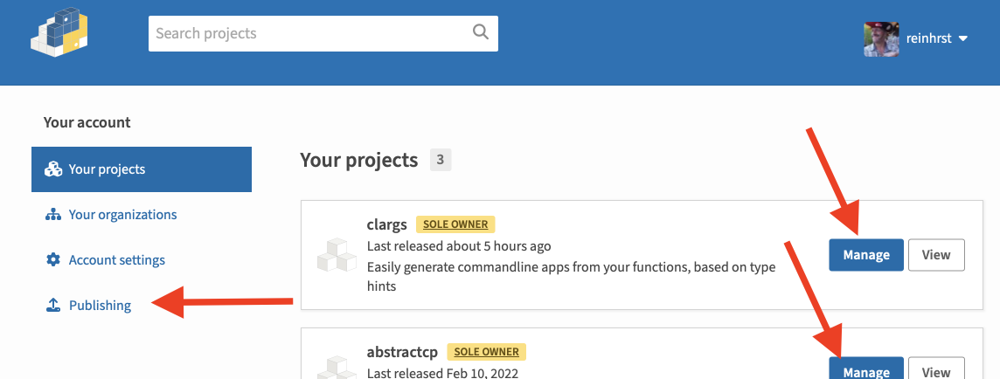
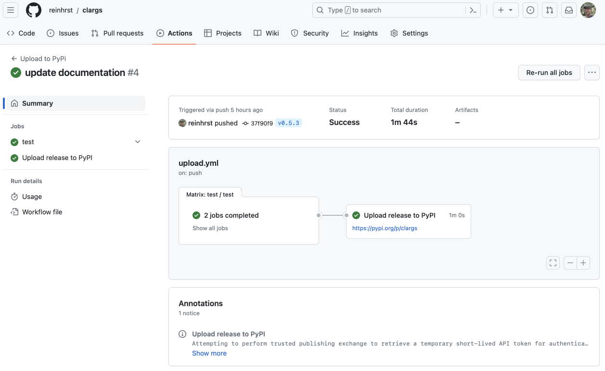

---

title: "Best practices for making a PyPI package (including automatic building, 2023)"
tags:
  - howto
  - tech

header:
  image: header.jpg
  message: image created by Bing Image Creator

toc:
  enable: true
---

<!--begin-summary-->

I created a bunch of commandline programs in Python to help me with machine learning tasks.
Last week I got so annoyed that every time I changed or extended a program, I had to also update the commandline interface for it, that I decided to do something about it.
And so [`clargs`][1] was born, a package that takes a function, inspects it's signature, and creates the correct commandline interface through Python's `argparse`.

This post is not about this particular package, but about the lessons I learned how to create a package.
It's the latest and greatest and best practices in July 2023.
This includes setting up testing (with `tox` and `unittest`), setting up GitHub actions (both so that every commit gets tested, and that a new version gets built and pushed to PyPI whenever I tag a new release). It even solves the problem that I want to have one and only one place where I specify the version number!

[1]: https://pypi.org/project/clargs/
<!--end-summary-->

This document is written for someone who knows what PyPI is, who knows what a Python Package is, and can work with Git and GitHub.

In this document I'll take you through the different steps of setting up the perfect PyPI package:

- [Create a package (locally)](#create-a-package)
- [Add some tests](#add-tests)
- [Set up `tox` to test the package](#add-tox)
- [Setup actions (workflow) on GitHub to run tests on each code push](#setup-action-or-workflow-on-github-to-run-tests-upon-commit)
- [Setup Trusted Publishing on PyPI](#setup-trusted-publishing-on-pypi)
- [Setup a GitHub action (workflow) to push a new version to PyPI](#set-up-a-workflow-to-build-the-package-and-publish-to-pypi)
- [Make sure the package version is taking from the latest tag](#get-the-version-number-from-the-tag)

Finally I discuss why I [don't like 100% the current solution, and what an improvement would be](#alternative-wip). I want to make clear that, although I feel an improvement is possible, I'm still very happy with the current setup!

If you want to follow along with some real-life code, the he `clargs` repository is set up just as described in this document in [revision `37f990f`][5].

## Create a package

In this tutorial we'll be making a package named `shovel` (the [shovel is mightier than the sword][3]).
(If you're just experimenting, it's suggested you use a package name `shovel_USERNAME`, also because there is already a `shovel` package on PyPI.)

The directory format for a package [looks like this][2]:

```ascii
shovel/
├── LICENSE
├── pyproject.toml
├── README.md
├── src/
│   └── shovel_USERNAME
│       ├── __init__.py
└── tests/
```

Fill in your `pyproject.toml`, `LICENSE` and `README.md` files [according to the tutorial][4] (if you're not sure which `build-system` to use, just use `setuptools` to be able to follow along 100% with this document; it doesn't seem to matter much for simple packages).

Put some code in the `__init__.py` package file (or create more files). If you're out of inspiration, just use the following:

```python
def hit():
    print("HITTING! YEAH!")
    return "hit"


def dig():
    print("Seriously? Boring!")
    return "dig"
```

If you want to run some code that uses the package, for you now you should prefix it with `PYTHONPATH=#PATH_TO_SHOVEL#/src` to make sure the `shovel_USERNAME` package can be found.

## Add tests

You probably want some automated tests for your package.
I'm using python's `unittest` package (but you may want to use something else).

Create a file `tests/test_shovel.py` and add some code:

```python
import shovel_USERNAME
import unittest


class MyTestCase(unittest.TestCase):
    def test_hit(self):
        result = shovel_USERNAME.hit()
        self.assertEqual(result, "hit")

    def test_dig(self):
        result = shovel_USERNAME.dig()
        self.assertEqual(result, "dig")

    ...
```

To run these tests manually, run the following command (from the toplevel directory)

```
PYTHONPATH="$(pwd)/src" python -m unittest discover --start test --buffer
```

Again we set the `PYTHONPATH`, we then tell the python `unittest` module to look for tests (`discover`), starting in the `test` directory. Finally, `--buffer` tells the test to suppress the output unless there is an error.


## Add `tox`

`tox` can run tests on several python versions, or in parallel.
First of all, install `tox` (`pip install tox` -- you probably want to do this in a virtual environment).

Next we need a `tox.ini` file to tell `tox` what to do.


I saw while writing the `clargs` package that `tox` can also get its configuration directly from `pyproject.toml`.
This sounds great, however at the current version, all you do is add the `.ini` as one big string into the `.toml` file.
Until `tox` fixes this, I advise keeping a separate `tox.ini` file.



```ini
[tox]
requires =
    tox>=4
env_list = lint, types, py{310,311}

[testenv]
description = run unit tests
commands =
    python -m unittest discover --start test --buffer

[testenv:lint]
description = run linters
skip_install = true
deps =
    black==22.12
commands = black --check {posargs:.}

[testenv:types]
description = run type checks
deps =
    mypy>=1.4.1
commands =
    mypy .
```


This file tells `tox` to run `python -m unittest discover --start test --buffer` on both python 3.10 and python 3.11 (this is all that is supported by my package).
In addition a linter is run, and a `mypy` checks the types; if you don't need this, please remove the appropriate sections, and remove the command from the `env_list`.

To test your setup, just type `tox`. Note that `tox` itself knows where to find the package (so `PYTHONPATH=` is not necessary anymore).

`tox` does not install the correct python versions, you're responsible yourself for that. Use something like [`pyenv`][6] for that.

## Setup action (or workflow) on GitHub to run tests upon commit

GitHub allows you to run the tests on their platform upon each commit, and send you an email if a test fails.
This is done through creating a workflow in GitHub Actions.

To create a workflow, create a `.github/workflow` directory in your repository, and add a file `run-tests.yml` (note: this document assumes that you're working in your `main` branch; things might be a bit different when you're in other branches).

Now in this `run-tests.yml` file we put the following:

```yaml
name: Run package tests

on:
  push:
    branches:
      - "**"  # all branches (this will ignore tag-pushes)
  pull_request:
    branches:
      - "**"
  workflow_call: {}

jobs:
  test:
    runs-on: ubuntu-latest
    strategy:
      matrix:
        python-version: ['3.10', '3.11']

    steps:
    - uses: actions/checkout@v3
    - name: Set up Python ${{ matrix.python-version }}
      uses: actions/setup-python@v4
      with:
        python-version: ${{ matrix.python-version }}
    - name: Install dependencies
      run: |
        python -m pip install --upgrade pip
        python -m pip install tox tox-gh-actions
    - name: Test with tox
      run: tox
```

The `on` section defines when this workflow is run. In this case we define a push to a branch, a pull request to a branch, and `workflow_call`.
The `workflow_call` part is necessary in order to call the workflow from another workflow later.


In order to have a workflow run on a push, you can just have a `on: ["push"]` section.
However this will run the workflow on every push, also when only tags are pushed.
In order to run only when branches are pushed, the `branches: ["**"]` section is present.



The `matrix` command starts two parallel test environments, one with python 3.10 and one with 3.11.
In order to control which `tox` steps are run in which environment, we have to add one more section to the `tox.ini` file:
```ini
[gh-actions]
python =
    3.10: py310
    3.11: py311, types, lint
```

So the `py310` is being run in the python 3.10 environment, whereas all other steps are done on the python 3.11 environment.

## Setup Trusted Publishing on PyPI

In the next step, we want GitHub to push the built package to PyPI.
The traditional way to do this was to generate a token on PyPI, then use that token as a secret in your workflow, however [starting in spring 2023][7] there is a new and better method: Trusted Publishers.
In layman's terms it means that you tell PyPI what GitHub repository is building your package, and then when an GitHub action in that repository tries to publish your package, it just works.
So let's set this up!

Obviously we need to start by making sure we have an account on [PyPI][8] (either make an account or log in).
Then click on the arrow next to your account, and select "Your projects".

Here if you want to set this up for an existing package, click "Manage" on the package card, else choose "Publishing" on the left.





On the next page, fill in the GitHub owner (your GitHub name if you have it on a non-organisation GitHub repo), repository name and workflow name (which will be `publish.yml` in my case).
For simple one-person projects, it's OK to leave Environment name empty.


And that's it, Trusted Publisher set up!

## Set up a workflow to build the package and publish to PyPI

We will be using the [`pypa/gh-action-pypi-publish`][9] action to publish the package to PyPI (read on that page for more info on how to use the action).
However before we can push something, we need to build the package.

[This page][10] tells us that this is as simple as running:

```
pip install build
python -m build
```

Before we want to build, we need to run the tests though; we wouldn't want to risk a package with errors to be put live.
So we end up with the following workflow for `publish.yml` (make sure you use the same name as you set in the Trusted Publisher step on PyPI).
Note that in this workflow we call `python -m build` with some more parameters to control the build.

```yaml
name: Upload to PyPi

on:
  push:
    tags:
      - "v*"


jobs:
  test:
    uses: ./.github/workflows/run-tests.yml

  build-and-publish:
    needs: test
    name: Upload release to PyPI
    runs-on: ubuntu-latest
    environment:
      name: pypi
      url: https://pypi.org/p/shovel_USERNAME
    permissions:
      id-token: write  # IMPORTANT: this permission is mandatory for trusted publishing
    steps:
    - uses: actions/checkout@v3
    - name: Set up Python
      uses: actions/setup-python@v4
      with:
        python-version: "3.x"
    - name: Install pypa/build
      run: >-
        python3 -m
        pip install
        build
        --user
    - name: Build a binary wheel and a source tarball
      run: >-
        python3 -m
        build
        --sdist
        --wheel
        --outdir dist/
    - name: Publish package distributions to PyPI
      uses: pypa/gh-action-pypi-publish@release/v1
```

We define the `test` job as just running the `run-tests.yml` workflow (this is only possible because we have an `on: workflow_call` section in that file).
In the `build-and-publish` step, we say that we need the `test` step to be complete first.
Afterwards, it's simply pip installing `build`, running the `build` module, and then using the `pypa/gh-action-pypi-publish@release/v1` to do the publish.

At the top we say that we want to the action to run when there is a push of a tag starting with `v` (e.g. `v0.5.1`).

(you should probably change `shovel_USERNAME` as well in the file above).

After committing and pushing this to GitHub, you're ready to go:

```
git tag v0.0.1
git push --tags
```
and your test-build-publish will run:






## Get the version number from the tag

Now there is one thing a bit frustrating in this setup: in order to release a new version, you should first update the version number in the `pyproject.yml` file, then commit and push that, then make a tag (with the same version number -- or actually, any string starting with a `v`) and then push that.
Doing things twice is messy.


Before you implement this step, please read the next section as well, which explains why I'm not 100% happy with this solution


The current version of `clargs` fixes this by using [`setuptools_scm`][11], which gets the version number by looking at git.
Specifically it does something like "look at the latest tag on the current branch that looks like it could be a version number; if it's the current commit, I have my version number, else I add some stuff to show that I have unversioned commits since".

In practice this should work for us: when the `publish.yml` workflow runs, it should get the version from the latest (=current) tag!

In order to get this to work, we need some changes to `pyproject.toml`.

- Change the `requires` line under `[build-system]`: `requires = ["setuptools>=61.0", "setuptools_scm[toml]>=7.1"]`
- Remove the `version = ...` line
- Add a line `dynamic = ["version"]` to tell the system to get the version number dynamically

(See [the finalized `pyproject.toml` file here][14].)

Now, if you run `git tag v0.5.1; git push --tags` you will see a version `v0.5.1` appear in PyPI a within a minute or so!!


## Alternative (WIP)

I'm not 100% content with the last step, for a number of reasons:
- I feel the version number should be part of the code (not a tag). This way when you look at the code you can instantly see what version number you're looking at[^version].
- When releasing a new version, you have to consult your tag-list to see which version is currently the latest.
- Tags are not part of the code. You cannot see who placed a tag[^lightweight-tag], and someone can delete a tag and you won't be able to see this in the history.
- If you want other parts of your code to have access to the version number (e.g. you want to fill a `__version__` attribute on your module), this is less that trivial (you can get to the version number using `from importlib.metadata import version; version('shovel')`, but it seems more complex than it is).


Actually, `setuptools-scm` does a lot more than we're using it for now, and I can see that in larger deployments it would be amazing that it can make a unique version number from every commit this way.
However for me all this is overkill, and I rather don't deal with the magic.


So what I'm thinking about as an alternative is to have a file `VERSION.txt` in the root, which contains one line of data: `v0.5.1-0`.
Of this, the part until the last `-\d+` is the version number. The last number is the retry number.
Rather than triggering the `publish.yml` workflow on a tag, it gets triggered by a change in this file.
If triggered, it does the following actions:

- If new version < old version: raise error ("version number cannot go down")
- If new version == old version:
  - if new retry number < old retry number: raise error ("retry number cannot go down for same version")
  - if new retry number == old retry number: raise error (i.e. only change in file metadata), do nothing
  - if exists(tag with new version number): raise error ("version has already been published")
- If new version > old version OR (new version == old version AND new retry number > old retry number): Run workflow
- After workflow complete (i.e. published to PyPI): create tag with version number (so that people can still see the releases on GitHub).

`pyproject.toml` can then [get version number dynamically][13].

I hope to build something like this soon(ish).


[^version]: I know that this is not fully correct; all you can see is what the latest version is that you released. Still, that's more info than nothing.
[^lightweight-tag]: Looking at [this StackOverflow question][12] this seems to be true only for lightweight tags, not annotated tags. Anyways, lightweight tags is what you make when you do `git tag v0.5.1`.

[2]: https://packaging.python.org/en/latest/tutorials/packaging-projects/#creating-the-package-files
[3]: https://mythic-quest.fandom.com/wiki/Shovel
[4]: https://packaging.python.org/en/latest/tutorials/packaging-projects/#configuring-metadata
[5]: https://github.com/reinhrst/clargs/tree/37f90f9cb79918c82b89eb1c871d37a5eb57a7db
[6]: https://github.com/pyenv/pyenv
[7]: https://blog.pypi.org/posts/2023-04-20-introducing-trusted-publishers/
[8]: https://pypi.org
[9]: https://github.com/pypa/gh-action-pypi-publish
[10]: https://packaging.python.org/en/latest/tutorials/packaging-projects/#generating-distribution-archives
[11]: https://pypi.org/project/setuptools-scm/
[12]: https://stackoverflow.com/q/6770298/1207489
[13]: https://setuptools.pypa.io/en/latest/userguide/pyproject_config.html#dynamic-metadata
[14]: https://github.com/reinhrst/clargs/blob/37f90f9cb79918c82b89eb1c871d37a5eb57a7db/pyproject.toml
