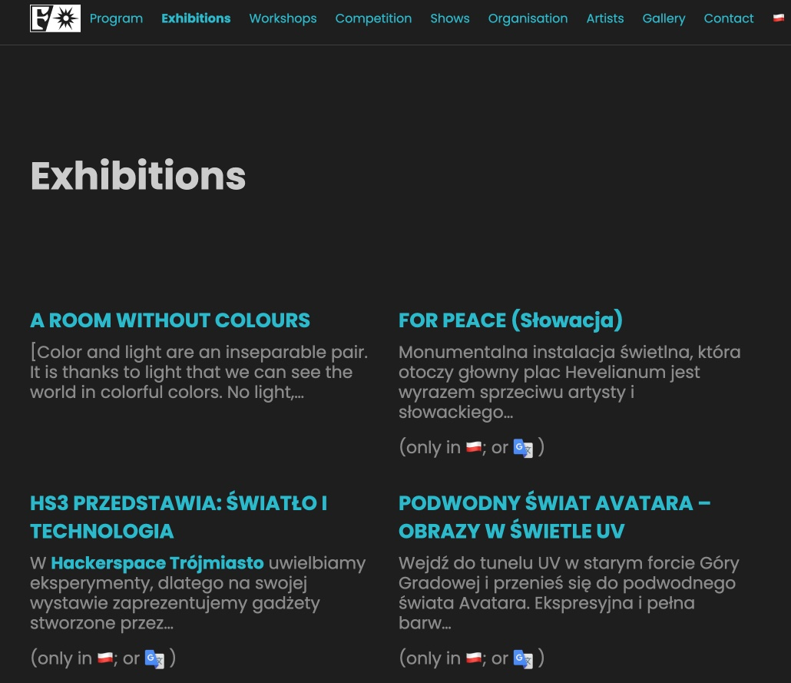

In this post I describe a way to make a single-language hugo site, dual- (or multi-)language.
There are many approaches to this, and which approach is best, depends on kind of multi-language site you want.
So before you just implement these steps, please read below what you're going to get, and then decide if this is (or is not) the best way forward.
I mostly wrote this down since it's my second time doing it, and someone (including future-me) might find these comments helpful.

The situation that we're trying to solve here is where there is a working single-language website, with existing structure, in a primary language (let's say Polish) and we want to start serving English-speaking people as well.
We will translate the pages slowly, over time, possibly never actually finishing all of them.
The system should work equally well if English is the primary language, or even in case we want more than two languages (however this latter case was never tested).

An example of what you'll end up with in the end can be found on https://hs3.pl/.

Make sure to read the [internationalization file on the hs3.pl repo][2].

After we're done, we'll end up with the following situation:
- The home-page (when just going to https://hs3.pl/) is in the primary language (Polish).
- The existing (Polish) urls should not change (no broken links from outside).
- Language is selected by a prefix (in our case, paths starting with `/en/` are English). The prefix is skipped for the primary language (so that existing urls don't change). There is no data stored in cookies or client side storage.
- Every page has a language-switcher-button, switching to the same page in another language (or a message if the page does not exist in the other language)
- Pages have localized urls (so the same page is for instance https://hs3.pl/wydarzenia/ in Polish, and https://hs3.pl/en/events/ in English).
- Branch-pages show leaves preferably in own language, but if this is not available, shows the item in the other language (so for instance, if there are 3 events (leaves), one of them only exists in Polish, one is in both Polish and English, and one is only in English), then both the English and the Polish events overview (branch) page will show 3 leaves. The https://hs3.pl/wydarzenia/ page will show 2 Polish events and one English one, the https://hs3.pl/en/events/ page will show 2 English events and one Polish one. The order of events is the same on both pages.
- If there is a leaf (only) in another language  than we're currently showing, then we show the leaf with a flag of the other language, and a google-translate link.
- The intention is that translated copies of the same page contain the same information. Things will not work so well if for instance the English translation has different dates for the event (e.g. because there are English and Polish language event days). Also things like #tags are ideally the same (not translated, literally the same!), and one should not be a very small summary of the other.

I wrote this post while updating https://festiwalswiatla.hs3.pl, which is a separate hugo site, organisationally related to https://hs3.pl.


  


## Step 1: Prepare the site for multi-lingualness

We start by making Hugo aware that it should become multi-lingual, by updating the config file and some helper files.

```toml
DefaultContentLanguage = "pl"

[languages]
[languages.pl]
languageName = "🇵🇱"
contentDir = 'content/pl'

[languages.en]
title = "Festival of Light 2023"
contentDir = 'content/en'
languageName = "🇬🇧"
```

We define the two languages in the section, and directly replace the site title in English.
We also define the default language to be Polish, so the we don't need the `/pl`/ in the url.
As you can see, I use unicode-flags for language names, but `EN` and `PL` would do equally well if you prefer that (or anything else, this is just for human consumption).
Now is also the time to search for other strings in this file that need translation.

I found some `param`:
```toml
  [params.footer]
    copyright_text = 'Dołącz do nas!'
    copyright_link = 'https://hs3.pl/wlacz-swiatlo'
```

so let's split this out to different languages:

```toml
[languages.pl.params.footer]
  copyright_text = 'Dołącz do nas!'
  copyright_link = 'https://hs3.pl/wlacz-swiatlo'

[languages.en.params.footer]
  copyright_text = 'Join us!'
  copyright_link = 'https://hs3.pl/turn-on-the-light'
```

(I should also make a note to remember to create https://hs3.pl/turn-on-the-light.)

And then finally we have the menu, which looks something like this:
```toml
[menu]
  # Main Menu
 [[menu.main]]
    name = "Wystawy"
    url = "/wystawy/"
      weight = 2

  [[menu.main]]
      name = "Artyści"
      url = "/artysci/"
      weight = 7

...
```

Rather than splitting out the menu into a `language.pl.menu.main` and `language.en.menu.main`, I will use Hugo's built-in i18n features.
This way I only have to define the links and weights once, and the menus cannot get out of sync.
Later we'll add some hugo-magic to make sure that the link to `/wystawy/` will be `/wystawy/` in Polish, and `/en/exhibitions/` if we're looking at the English page.

First we replace the `name = ....` parts in the menu with `identyfier`s:
```toml
[menu]
  # Main Menu
 [[menu.main]]
    identifier = "exhibitions"
    url = "/wystawy/"
    weight = 2

  [[menu.main]]
    identifier = "artists"
    url = "/artysci/"
    weight = 7

...
```

I choose English identifier names, but this doesn't really matter that much, they are just identifiers.

We make two files under the `i18n` directly (which you'll have to create), for the translations: `i18n/pl.toml` and `i18n/en.toml`:

```toml
[exhibitions]
other = "Wystawy"

[artists]
other = "Artyści"

...
```

```toml
[exhibitions]
other = "Exhibitions"

[artists]
other = "Artists"

...
```

(in case you're wondering, the `other` is needed because you could define a singular and plural version here and things like that. We just care about one single version: `other`).


Next, we update the code for the top-level menu (and any other menus that you have) to deal with the identifier-based menu items (note that we still support `.Name` as fallback), and throw all generated links through `relLangURL`, so that all links will automatically go to the right language.
You will have to update this code to produce the same html-code as your current menu; this is dependent on the theme you're using.

```go-html-template
<div id="main-menu" class="main-menu">
  <ul>
  {{ $currentPage := . }}
  {{ $menu := .Site.Menus.main}}
  {{range $index, $element := $menu}}
    {{ $active := or ($currentPage.IsMenuCurrent "main" .) ($currentPage.HasMenuCurrent "main" .) }}
    {{ $active = or $active (eq .Name $currentPage.Title) }}
    <li class="menu-item-{{ .Name | lower }} {{ if $active }}active{{ end }}">
      <a href="{{ .URL | relLangURL }}">{{ .Pre }}{{i18n .Identifier | default .Name }}</a>
    </li>
  {{end}}
  </ul>
</div>
```

Finally one last step, we told at the start that the content dir for the Polish content files is `contentDir = 'content/pl'`, so we better make that directory now, and move all the previous files under `/content/` into it. Afterwards let's also make `/content/en`.

Now reload the site, and if you did everything right, you will see..... exactly the same as before. Since we had a requirement that the primary language pages and urls don't change, and since we don't have a button yet to switch language (we will soon, I promise), everything looks exactly the same.


## Step 2: Actually seeing some results

After all the preparation, it would be nice if we could see some results of our work, so let's do that next.
First translate the homepage: copy `/content/pl/_index.md` into `/content/en/_index.md`, and translate the latter file, at least some words so you can see the difference (if you have no `/content/pl/_index.md` file, the homepage is generated differently, so you can skip the copy, and go on below).

Next we make a button (in the menu, but you could put it where ever you want) to switch language.
```go-html-template
{{ range $.Site.Home.AllTranslations }}
  {{ if ne $.Site.Language.Lang .Language.Lang }}
    {{ $translation := index (where $.Page.Translations "Language.Lang" .Language.Lang) 0 }}
    {{ $no_translation := index (where ($.Site.GetPage "/no-translation.md").Translations "Language.Lang" .Language.Lang) 0 }}
    <li class="nav-item"><a class="language-switch" href="{{ default $no_translation.Permalink $translation.Permalink }}">{{ .Language.LanguageName }}</a></li>
  {{ end }}
{{ end }}
```

There we go, we loop through all languages, and for every language that is not the current language, we show a link.
Alternatively you could make it so that you only show the current language, and when you click open a dropdown where you select, or something else creative.

If there is no translated version available, it will link to `/no-translation.md` in the target language. Let's make these files (`/content/pl/no-translation.md` and `/content/en/no-translation.md`) now:

```markdown
---
title: "No translation available"
---
🇬🇧Sorry, no translation is available for this page.
Use translation software, or find some other creative way to understand what it means 😊.
```

(and something similar in the Polish version)

Obviously you can make your own text, or even make the button behave differently if there is no translation (e.g. do a JavaScript `alert()`).

Once this is done, let's go to the homepage, and switch language (probably lots of things don't work yet, we'll take care of them in the next part).
Also, on another page in your primary language, press the button, and see that you're taken to `/en/no-translation`)

## Step 3: Fixing the homepage

So if you're lucky, the homepage in the secondary language already looks amazing and you can skip this whole section (or maybe get back to it when you're in trouble at some other page).
However normally the homepage is (at least partly) generated from the `layouts/home/index.md` and there is text on there.
Also there may be images that are broken, or data that is pulled from files in the `data` directory. Probably there are other problems you may encounter, but fixing those is an exercise for the reader (although usually the solution will employ one of the techniques in this section).

### Text in `layouts/home/index.md`

Unless you can easily move the text to `content/pl/_index.md`, your only solution is to use the `i18n` shortcode. As an example, we have a countdown on the homepage. This used to look like

```go-html-template
<div class="container">
  <h1 id="headline">Do Festiwalu Światła zostało</h1>
  <div id="countdown">
    <ul>
      <li><span id="days"></span>dni</li>
      <li><span id="hours"></span>g</li>
      <li><span id="minutes"></span>m</li>
      <li><span id="seconds"></span>s</li>
    </ul>
  </div>
</div>
<script>
  (function () {
....
```

This can be replaced by

```go-html-template
<div class="container">
  <h1 id="headline">{{ i18n "time-until-festival" }}</h1>
  <div id="countdown">
    <ul>
      <li><span id="days"></span>{{ i18n "days" }}</li>
      <li><span id="hours"></span>{{ i18n "time-h" }}</li>
      <li><span id="minutes"></span>{{ i18n "time-m" }}</li>
      <li><span id="seconds"></span>{{ i18n "time-s" }}</li>
    </ul>
  </div>
</div>
<script>
  (function () {
...
```

and then filling in the right tags in the `i18n/{pl,en}.toml`.

### Broken images

One of the issues you run into is that the directory where your primary and secondary language version are hosted are not the same anymore.
Where in the primary language version, the homepage is in `/`, in the English version it's under `/en/`.
This means that any relative links (e.g. `images/foo/bar.jpeg`) will not work anymore in the English version (since it will look at `en/images/foo/bar.jpeg`).

A quick solution is to make all your links absolute (just add a `/` in front of all of them).
Whether this works depends on your hosting; if your website is under `http://www.site.com/foobar/`, then making them all start in `/` doesn't work (note that also if this may not be true for your live website, this may be true for the staging or CI environments).

What should always work (and else people can fix it by adding the right `baseURL` config), is using `{{ "/images/foo/bar.jpeg" | absURL }}` (or `relURL`); this should make a url relative to the `baseURL`.

### Data from the `/data` directory

Some sites have some data-driven sections, where the data is pulled from the `/data/*.json` files. If there's text in these files, this may be problematic.

Solution 1 is kind of what we did with the menus: just give some `identifier` field in the data structure, and then pull your translation from the `i18n/{pl,en}.toml` files, however if there's a lot of text, this may not feel clean. So there is another solution.

Normally you access data through `.Site.Data.FILENAME.FIELD...` or something like this.
If your start your template with the following code, and then access the data through `$data.FILENAME.....`, you can have language-specific data files:

```go-html-template
{{ $data_nolang := .Site.Data }}
{{ $data_lang := index .Site.Data .Site.Language.Lang }}
{{ $data := merge $data_nolang $data_lang }}
```

Now you can have a `/data/pl/sponsors.json` and `/data/en/sponsors.json`. They will overwrite whatever values are found in `/data/sponsors.json` if it exists.

With these three tricks, you should be able to get most (all?) of your homepage working.


## Step 4: do the rest of the site :)

The idea is that it's not necessary to translate all pages, but I think it's probably a good idea to do it for the main pages (at least those pages in the main menu should be translated).

Take a page (let's say a branch-page, e.g. `Events`).
The Polish page is somewhere like `/content/pl/wydarzenia/_index.md`. It's important to make this exact same file in the `en` directory (even though we want a different url; by having the same filename, Hugo knows that it's the same file, just different translations), so we copy this file to `/content/en/wydarzenia/_index.md` (making directories along the way).

Translate the things in the `_index.md` file, and manually add the url where you would want it to be (e.g. `/en/events`). Don't forget the `/en/` (since that's where all English files should be).
Now save the file and you would hope that on the (English) homepage, the menu now points to `/en/events` (but it doesn't, it's `/en/wystawy`, an URL that does not exist.

Luckily Hugo has a built-in solution for that: Replace in `config.toml` the menu-section all `url = ` with `pageref =`:

```toml
[menu]
  # Main Menu
 [[menu.main]]
    identifier = "exhibitions"
    pageref = "/wystawy/"
    weight = 2

  [[menu.main]]
    identifier = "artists"
    pageref = "/artysci/"
    weight = 7
...
```

And magically the links go to `/en/events`. However `pageref` is less forgiving than `url`; if your `pageref = "/wystawy/"`, hugo expects this page to be hosted on `/content/pl/wystawy/_index.md` (note the underscore before `index.md`). If you want to link to `/wystawy/index.md`, or `/wystawy.md`, use `/wystawy/index.md` or `/wystawy.md` in your menu `pageref`!

To do the same in other spots on the site, you need to throw all your links through some function.
In template pages, you have to look up the page and generate the link

```go-html-template
<a href="{{ (site.GetPage .href).Permalink }}">...</a>
```

For links created in markdown, you can use the following shortcode (`link.html`)

```go-html-template
{{- /*
Makes a link. Usage:
{}About us{}

The `ref` is the .PageRef of a page, which is usually the filename (without the `/content/LANGUAGECODE` prefix, and without `_index.md` or `.md` suffix.
So for instance, `/zasoby` or `/zasoby/finanse`.
Note that even though the `/zasoby/finanse.md` page defines `url: /finanse` in the front-matter, using `/finanse` as ref in this tag wouldn't work.
Note that the same `ref` should be used in all languages (since the filenames should be the same in all languages).

- If the ref-page exists in the language of the page, a normal link is made.
- If the ref-page exists only in other languages, a warning is added to the link (which will lead to the language it exists in) and a "Google Translate" link is generated as well.
- If the ref-page doesn't exist at all, an error is thrown (since we don't like broken links on the website).

*/ -}}
{{- $ref := .Get "ref" -}}
{{- $linktext := .Inner -}}
{{- $pages := newScratch -}}
{{- with (site.GetPage $ref) -}}
    {{- $pages.Set "ownlang" . -}}
{{- else -}}
    {{- range $.Page.Sites -}}
        {{- with (.GetPage $ref) -}}
            {{- $pages.Add "otherlang" (slice .) -}}
        {{- end -}}
    {{- end -}}
{{- end -}}
{{- with $pages.Get "ownlang" -}}
    [{{$linktext}}]({{ .Permalink }})
{{- else -}}
    {{- with $pages.Get "otherlang" -}}
        {{/* for now only show first other language */}}
        {{- with (index . 0) -}}
        [{{$linktext}} (in {{.Language.LanguageName}}]({{.Permalink}});
        [](http://translate.google.com/translate?{{(slice "js" "n" "sl" .Language.Lang "tl" site.Language.Lang "u" .Permalink) | querify }}))
        {{- end -}}
    {{- else -}}
        {{ errorf "Broken link on %q: %q" $.Page.File.Path $ref}}
    {{- end -}}
{{- end -}}
```

This shortcode tries to link the same language page, if that fails it will warn and offer a Google Translate link.

In your markdown you now call them like:
```markdown
{}Access to the budget{}
```

In both cases, make sure to use the filename of the target in the reference.


### Get the content (from all languages) in the list 

So our (branch) page now works, but doesn't have content (leafs) in it.
This makes sense, since by default, hugo only looks for leafs under the directory where the branch is defined (i.e. it's looking for leafs in `/en/wystawy/*`, and there are non there.
So we have to alter the code, so that also the leafs in another language are selected (and then filter the result so that leafs that exist in different languages only appear once).

If we look at the `layouts/_default/list.html` section (you might have to copy this file out of the theme), we'll see something like

```go-html-template
{{ range .Pages.ByWeight }}
...
{{ end }}
```

So this loops over all children of this item. We're going to replace this

```go-html-template
{{ $allPages := where (where .Site.AllPages "Type" "==" $.Page.Type) "Kind" "page" }}
{{ $pageByTranslationKey := newScratch }}
{{range $allPages }}
{{ $pageByTranslationKey.Add .TranslationKey (slice .) }}
{{end}}
{{ $preferredPages:= newScratch }}
{{ range $key,$pages := $pageByTranslationKey.Values }}
  {{ $preferredPage := index (where $pages "Language.Lang" $.Page.Language.Lang | default $pages) 0 }}
  {{ $preferredPages.Add "pages" (slice $preferredPage) }}
{{ end }}

...

{{ range (.Paginate ($preferredPages.Get "pages").ByWeight).Pages }}
  ...
{{ end }}
```

We first find all pages of the current type, and then check which are the same page (in different languages), and then take the current language if available, else a (random) other language (will always be THE other language in a two language system; else you'd have to come up with some priority rules).

Then we have to manually sort (in this case by weight, but can be anything), and then manually paginate over them.

Finally we can add some code that shows a warning when the page is not in the current language:
```go-html-template
{{ if (ne .Language.Lang $.Page.Language.Lang) }} 
<p>
  (only in {{ .Language.LanguageName }}; or
  <a href="http://translate.google.com/translate?{{(slice "js" "n" "sl" .Language.Lang "tl" site.Language.Lang "u" (.Permalink | absURL)) | querify | safeURL}}">
  
  </a>)
</p>
{{ end }}
```

Note that google translate only works with pages that Google can reach (so not localhost). Of course you can come up with alternative solutions.


## Step 5: test

Now, "all" that remains is test, click, switch language, check if all pages work, etc.

## Bonus: think about what pages to translate, and whether to add extra info

It feels good to translate more and more pages on your website (Google Translate is great; just copy-paste in the raw markdown, and you get back a file that is almost valid markdown again!.
However in addition to just Google-Translating stuff, please consider if you need to add more info, warnings, etc.
For instance, if I find an English announcement for a talk, I assume the talk will be in English.


[2]: https://github.com/hs3city/hs3.pl/blob/d2c42d1e2a5609d850679d37e744f96172a7d23f/i18n.md
